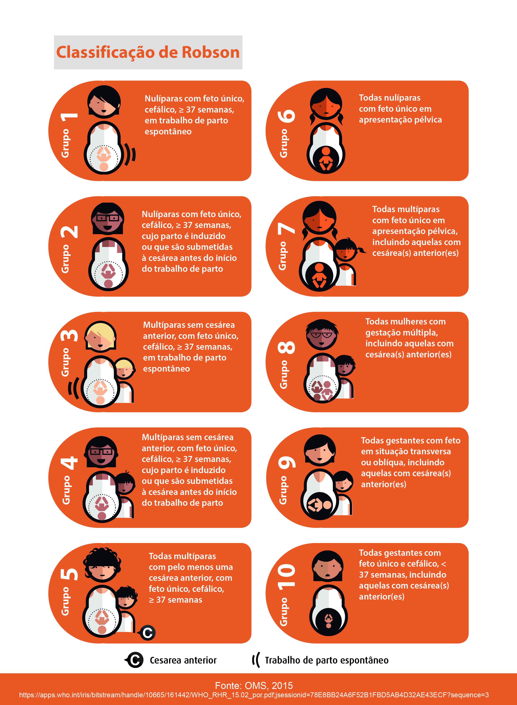

<style>
.navbar.navbar-inverse {
  background-color: #0A1E3C !important;
  border-color: #0A1E3C !important;
}
.navbar-brand {
    color: #ffffff !important;
    font-size: 1.3rem;
    vertical-align: middle;
}
body {
    font-size: 1em;
    padding: 83px 15px 8px;
}
.negrito {
  font-weight: 700;
}
.chart-title {
    border-bottom: 1px solid #dee2e6;
    font-size: 1.1em;
    font-weight: 600;
    padding: 7px 10px 4px;
}
</style>

```{r}
knitr::opts_chunk$set(message = FALSE)
```


```{r setup, include = FALSE, cache=TRUE}
# Libraries -----------------
#flexdashboard
library(flexdashboard)
#data
library(tidyverse)
library(janitor)
#graph
library(ggplot2)
library(scales)
#library(plotly)
#shiny
library(shiny)
library(shinythemes)
library(shinyHeatmaply)
library(shinydashboard)
library(shinyjs)

# SINASC --------------------
# tratamento
dados_sinasc2021 <- read.csv("dados_sinasc.csv.gz") %>%
  clean_names()

dados_premat_cons <- read.csv("prematuridade_consultas_muni.csv.gz") %>%
  clean_names()

dados_robson <- read.csv("robson_muni.csv.gz")

dados_robson_cesarea <- read.csv("robson_cesar_muni.csv.gz") %>%
  clean_names()

tabela_aux_municipios <- read.csv("tabela_auxiliar_municipios.csv")

# ordenar em ordem alfabetica municipios e estados
estadosChoices <- sort(unique(tabela_aux_municipios$uf))

# ajuste de niveis robson
niveis <-
  c("1", "2", "3", "4", "5", "6", "7", "8", "9", "10", "faltante")
dados_robson[["grupo_robson_aux"]] <-
  factor(dados_robson[["grupo_robson_aux"]], niveis)
dados_robson_cesarea[["grupo_robson_aux"]] <-
  factor(dados_robson_cesarea[["grupo_robson_aux"]], niveis)
```

Sobre
=============================================

<h3><span style = "font-weight: bold;">O OOBr Indicadores Obstétricos</span></h3>

É um painel de visualização dinâmico com análises sob a perspectiva de algumas variáveis da base de dados do Sistema de Informações de Nascidos Vivos (SINASC). As informações consideradas são referentes aos registros de nascidos vivos a partir de 1996.

<h3><span style = "font-weight: bold;">O Observatório Obstétrico Brasileiro (OOBr)</span></h3>

Tem como objetivo disponibilizar plataformas interativas de monitoramento e análises de dados públicos cientificamente embasadas e disseminar informações de qualidade e relevantes acerca da área da saúde materno-infantil.

Conta com **pesquisadores** da <a href = https://www.ufes.br target = _blank> Universidade Federal do Espírito Santo (UFES) </a> e da <a href = https://www5.usp.br target = _blank> Universidade de São Paulo (USP) </a>. Para maiores informações, veja o <a href = https://observatorioobstetricobr.org/ target = _blank> site do OOBr </a>.

<h3><span style = "font-weight: bold;">Os dados</span></h3>

São providos do DATASUS do Ministério da Saúde e formam um grande banco anual composto por todos os registros das declarações de nascidos vivos a partir do ano de 1996. Nessa plataforma, os dados do SINASC são previamente tratados pela PCDaS com base no fluxo ETL (_Extract_, _Transform_ e _Load_). Atualmente, a PCDaS disponibiliza dados do SINASC até 2022 **(sendo estes preliminares)**, atualizados na última sexta feira de cada mês, tendo a última atualização ocorrido em 31 de agosto de 2023. Os dados podem ser acessados em: Herzog, R. S.; Francisco, R. P. V.; Rodrigues, A. S. Indicadores Obstétricos [banco de dados], 2022, Observatório Obstétrico Brasileiro (OOBr). Disponível em DOI: https://doi.org/10.7303/syn35916919.

<h3><span style = "font-weight: bold;">Como citar esse painel</span></h3>

Observatório Obstétrico Brasileiro. OOBr Indicadores Obstétricos, 2022. Disponível em https://observatorioobstetrico.shinyapps.io/indicadores-obstetricos. DOI: https://doi.org/10.7303/syn52503703.3


<h3><span style = "font-weight: bold;">Contato</span></h3>

Para comentários, sugestões e colaborações científicas, por favor, envie uma mensagem para <a href="mailto:comunicacao@observatorioobstetricobr.org"> comunicacao@observatorioobstetricobr.org</a>. E para acompanhar o trabalho do OOBr de perto, siga-o nas redes acessando os ícones do canto superior direito.

<h3><span style = "font-weight: bold;">Realização</span></h3>

<center>
```{r, out.width="10%", fig.show='hold'}
knitr::include_graphics(c(
  "www/logos/realizacao/logo_oobr.png",
  "www/logos/realizacao/logo_ufes.png",
  "www/logos/realizacao/logo_medicina_usp.png", 
  "www/logos/realizacao/logo_daslab.png"
))
```
</center>

<h3><span style = "font-weight: bold;">Financiadores</span></h3>

<center>
```{r, teste, out.width="10%", fig.show='hold'}
knitr::include_graphics(c(
  "www/logos/financiadores/logo_bill_melinda.png",
  "www/logos/financiadores/logo_cnpq.png",
  "www/logos/financiadores/logo_ms1.png", 
  "www/logos/financiadores/logo_ms2.png", 
  "www/logos/financiadores/logo_ms3.png", 
  "www/logos/financiadores/logo_fapes.png",
  "www/logos/financiadores/logo_fapes2.png"
))
```
</center>


<h3><span style = "font-weight: bold;">Apoio</span></h3>

<center>
```{r, out.width="8%", fig.show='hold'}
knitr::include_graphics(c(
  "www/logos/apoio/logo_pcdas.png",
  "www/logos/apoio/logo_odd.png"
))
```
</center>


Nascimentos {data-navmenu="Nascidos"}
=============================================

Inputs {.sidebar data-width=350}
---------------------------------------------
<br>
```{r input-nasc}
hr(); strong("Nascimentos"); hr()
p(em(HTML(paste("Obs.: os dados de 2022 são preliminares."))))
selectInput(
  inputId = "SelectMunEst_sinasc",
  label = HTML("<span class = 'negrito'>Selecione o nível de análise:</span>"),
  choices = c("Nacional", "Estadual", "Municipal"),
  multiple = FALSE
)
shiny::conditionalPanel(
  condition = "input.SelectMunEst_sinasc == 'Estadual'",
  selectInput(
    inputId = "SelectEst_sinasc",
    label = HTML("<span class = 'negrito'>Selecione o estado:</span>"),
    choices = estadosChoices,
    multiple = FALSE
  )
)

conditionalPanel(
    condition = "input.SelectMunEst_sinasc == 'Municipal'",
    selectizeInput(
      inputId = "SelectEstadoMun_sinasc",
      label = HTML("<span class = 'negrito'>Estado ao qual pertence o município:</span>"),
      choices = estadosChoices,
      options = list(placeholder = "Selecione um estado")
    ),
    selectizeInput(
      inputId = "SelectMun_sinasc",
      label = HTML("<span class = 'negrito'>Selecione o município:</span>"),
      choices = NULL,
      options = list(placeholder = "Selecione um município")
    )
)

observeEvent(input$SelectEstadoMun_sinasc, {
  updateSelectizeInput(
    inputId = "SelectMun_sinasc",
    choices = sort(tabela_aux_municipios |> dplyr::filter(uf == input$SelectEstadoMun_sinasc) |> pull(municipio) |> unique())
  )
})

shiny::sliderInput(
  inputId = "anos_sinasc",
  label = HTML("<span class = 'negrito'>Selecione o intervalo de anos:</span>"),
  min = min(dados_sinasc2021$ano),
  max = max(dados_sinasc2021$ano),
  value = c(min(dados_sinasc2021$ano), max(dados_sinasc2021$ano)),
  sep = ""
)
```
<br>

*****

Número total de nascidos vivos.

Row {data-width=650}
---------------------------------------------

### Tabela Nascimentos

```{r table-nasc}
DT::renderDT({
  if (input$SelectMunEst_sinasc == 'Nacional') {
    dados_sinasc2021 %>%
      group_by(pais, ano) %>%
      summarise(nascidos = sum(nascidos)) %>%
      filter(ano <= input$anos_sinasc[2],
             ano >= input$anos_sinasc[1]) %>%
      ungroup() %>%
      select(ano, nascidos) %>%
      DT::datatable(
        .,
        colnames = c("Ano", "N° de nascimentos"),
        rownames = FALSE,
        extensions = c("Scroller"),
        fillContainer = TRUE,
        options = list(
          searching = FALSE,
          paging = FALSE,
          info = FALSE,
          columnDefs = list(list(
            className = "dt-center", targets = "_all"
          ))
        )
      )

  }

  else if (input$SelectMunEst_sinasc == 'Estadual') {
    dados_sinasc2021 %>%
      group_by(uf, ano) %>%
      summarise(nascidos = sum(nascidos)) %>%
      ungroup() %>%
      filter(uf == input$SelectEst_sinasc,
             ano <= input$anos_sinasc[2],
             ano >= input$anos_sinasc[1]) %>%
      select(ano, nascidos) %>%
      DT::datatable(
        .,
        colnames = c("Ano", "N° de nascimentos"),
        rownames = FALSE,
        extensions = c("Scroller"),
        fillContainer = TRUE,
        options = list(
          searching = FALSE,
          paging = FALSE,
          info = FALSE,
          columnDefs = list(list(
            className = "dt-center", targets = "_all"
          ))
        )
      )

  }

  else {
    dados_sinasc2021 %>%
      filter(
        municipio == input$SelectMun_sinasc,
        uf == input$SelectEstadoMun_sinasc,
        ano <= input$anos_sinasc[2],
        ano >= input$anos_sinasc[1]
      ) %>%
      select(ano, nascidos) %>%
      DT::datatable(
        .,
        colnames = c("Ano", "N° de nascimentos"),
        rownames = FALSE,
        extensions = c("Scroller"),
        fillContainer = TRUE,
        options = list(
          searching = FALSE,
          paging = FALSE,
          info = FALSE,
          columnDefs = list(list(
            className = "dt-center", targets = "_all"
          ))
        )
      )

  }
})
```

Row {data-width=650}
---------------------------------------------

### Gráfico Nascimentos

```{r graph-nasc}
shiny::renderPlot({
  if (input$SelectMunEst_sinasc == 'Nacional') {
    dados_sinasc2021 %>%
      group_by(pais, ano) %>%
      summarise(nascidos = sum(nascidos)) %>%
      filter(ano <= input$anos_sinasc[2], ano >= input$anos_sinasc[1]) %>%
      ggplot(aes(x = ano, y = nascidos)) +
      geom_bar(stat = "identity",
               color = "black",
               fill = "#37399a") +
      scale_y_continuous(labels = unit_format(unit = "M", scale = 1e-6)) +
      scale_x_continuous(
        labels = seq(input$anos_sinasc[1], input$anos_sinasc[2], by = 1),
        breaks = seq(input$anos_sinasc[1], input$anos_sinasc[2], by = 1)
      ) +
      labs(x = NULL, y = "n° de nascimentos") +
      theme_linedraw()

  }

  else if (input$SelectMunEst_sinasc == 'Estadual') {
    dados_sinasc2021 %>%
      filter(uf == input$SelectEst_sinasc,
             ano <= input$anos_sinasc[2],
             ano >= input$anos_sinasc[1]) %>%
      group_by(uf, ano) %>%
      summarise(nascidos = sum(nascidos)) %>%
      ggplot(aes(x = ano, y = nascidos)) +
      geom_bar(stat = "identity",
               fill = "#37399a",
               color = "black") +
      labs(x = NULL, y = "n° de nascimentos") +
      scale_y_continuous(labels = unit_format(unit = "K", scale = 1e-3)) +
      scale_x_continuous(
        labels = seq(input$anos_sinasc[1], input$anos_sinasc[2], by = 1),
        breaks = seq(input$anos_sinasc[1], input$anos_sinasc[2], by = 1)
      ) +
      theme_linedraw()

  }

  else {
    dados_sinasc2021 %>%
      filter(
        municipio == input$SelectMun_sinasc,
        uf == input$SelectEstadoMun_sinasc,
        ano <= input$anos_sinasc[2],
        ano >= input$anos_sinasc[1]
      ) %>%
      ggplot(aes(x = ano, y = nascidos)) +
      geom_bar(stat = "identity",
               color = "black",
               fill = "#37399a") +
      labs(x = NULL, y = "n° de nascimentos") +
      scale_x_continuous(
        labels = seq(input$anos_sinasc[1], input$anos_sinasc[2], by = 1),
        breaks = seq(input$anos_sinasc[1], input$anos_sinasc[2], by = 1)
      ) +
      theme_linedraw()

  }
})
```

Partos Prematuros {data-navmenu="Nascidos"}
=============================================

Inputs {.sidebar data-width=350}
---------------------------------------------
<br>
```{r input-pp}
hr(); strong("Partos Prematuros"); hr()
p(em(HTML(paste("Obs.: os dados de 2022 são preliminares."))))
selectInput(
  inputId = "SelectMunEstPP",
  label = HTML("<span class = 'negrito'>Selecione o nível de análise:</span>"),
  choices = c("Nacional", "Estadual", "Municipal"),
  multiple = FALSE
)
shiny::conditionalPanel(
  condition = "input.SelectMunEstPP == 'Estadual'",
  selectInput(
    inputId = "SelectEstPP",
    label = HTML("<span class = 'negrito'>Selecione o estado:</span>"),
    choices = estadosChoices,
    multiple = FALSE
  )
)

conditionalPanel(
    condition = "input.SelectMunEstPP == 'Municipal'",
    selectizeInput(
      inputId = "SelectEstadoMunPP",
      label = HTML("<span class = 'negrito'>Estado ao qual pertence o município:</span>"),
      choices = estadosChoices,
      options = list(placeholder = "Selecione um estado")
    ),
    selectizeInput(
      inputId = "SelectMunPP",
      label = HTML("<span class = 'negrito'>Selecione o município:</span>"),
      choices = NULL,
      options = list(placeholder = "Selecione um município")
    )
)

observeEvent(input$SelectEstadoMunPP, {
  updateSelectizeInput(
    inputId = "SelectMunPP",
    choices = sort(tabela_aux_municipios |> dplyr::filter(uf == input$SelectEstadoMunPP) |> pull(municipio) |> unique())
  )
})

sliderInput(
  inputId = "anosPP",
  label = HTML("<span class = 'negrito'>Selecione o intervalo de anos:</span>"),
  min = min(dados_sinasc2021$ano),
  max = max(dados_sinasc2021$ano),
  value = c(min(dados_sinasc2021$ano), max(dados_sinasc2021$ano)),
  sep = ""
)
```
<br>

*****

Um parto é considerado prematuro quando a idade gestacional é menor do que 37 semanas, ou seja, se a variável `GESTACAO` da base de dados do `SINASC` for `1 (menos de 22 semanas), 2 (22 a 27 semanas), 3 (28 a 31 semanas), 4 (32 a 36 semanas)`.

Não são consideradas na `% prematuros` os casos sem informação se a gestação é prematura, ou seja, se `GESTACAO = 9 (ignorada)`.

Algebricamente, a `porcentagem de prematuros` é dada por:

$$
\mbox{% prematuros} = \frac{\mbox{N° partos prematuros}}{(\mbox{N° de nascimentos - N° sem informação)}} \times 100.
$$

Row {data-width=650}
---------------------------------------------

### Tabela Partos Prematuros

```{r table-pp}
DT::renderDT({
  if (input$SelectMunEstPP == 'Nacional') {
    dados_sinasc2021 %>%
      group_by(pais, ano) %>%
      summarise(
        nascidos = sum(nascidos),
        faltantes_prematuros = sum(faltante_premat),
        partos_prematuros = sum(premat),
        total_nascidos = sum(total_nascidos)
      ) %>%
      mutate(porcentagem_prematuros = round(
        partos_prematuros / (total_nascidos - faltantes_prematuros) * 100,
        2
      )) %>%
      filter(ano <= input$anosPP[2], ano >= input$anosPP[1]) %>%
      ungroup() %>%
      .[, c(
        "ano",
        "nascidos",
        "faltantes_prematuros",
        "partos_prematuros",
        "porcentagem_prematuros"
      )] %>%
      DT::datatable(
        .,
        colnames = c(
          "Ano",
          "N° de nascimentos",
          "N° sem informação",
          "N° partos prematuros",
          "% prematuros"
        ),
        rownames = FALSE,
        extensions = c("Scroller"),
        fillContainer = TRUE,
        options = list(
          searching = FALSE,
          paging = FALSE,
          info = FALSE,
          columnDefs = list(list(
            className = "dt-center", targets = "_all"
          ))
        )
      )
  }

  else if (input$SelectMunEstPP == 'Estadual') {
    dados_sinasc2021 %>%
      group_by(uf, ano) %>%
      summarise(
        nascidos = sum(nascidos),
        faltantes_prematuros = sum(faltante_premat),
        partos_prematuros = sum(premat),
        total_nascidos = sum(total_nascidos)
      ) %>%
      mutate(porcentagem_prematuros = round(
        partos_prematuros / (total_nascidos - faltantes_prematuros) * 100,
        2
      )) %>%
      ungroup() %>%
      filter(uf == input$SelectEstPP,
             ano <= input$anosPP[2],
             ano >= input$anosPP[1]) %>%
      select(ano,
             nascidos,
             faltantes_prematuros,
             partos_prematuros,
             porcentagem_prematuros) %>%
      DT::datatable(
        .,
        colnames = c(
          "Ano",
          "N° de nascimentos",
          "N° sem informação",
          "N° partos prematuros",
          "% prematuros"
        ),
        rownames = FALSE,
        extensions = c("Scroller"),
        fillContainer = TRUE,
        options = list(
          searching = FALSE,
          paging = FALSE,
          info = FALSE,
          columnDefs = list(list(
            className = "dt-center", targets = "_all"
          ))
        )
      )

  }

  else {
    dados_sinasc2021 %>%
      filter(
        municipio == input$SelectMunPP,
        uf == input$SelectEstadoMunPP,
        ano <= input$anosPP[2],
        ano >= input$anosPP[1]
      ) %>%
      rename(
        faltantes_prematuros = faltante_premat,
        partos_prematuros = premat,
        porcentagem_prematuros = porc_premat
      ) %>%
      mutate(porcentagem_prematuros = round(porcentagem_prematuros, 2)) %>%
      select(ano,
             nascidos,
             faltantes_prematuros,
             partos_prematuros,
             porcentagem_prematuros) %>%
      DT::datatable(
        .,
        colnames = c(
          "Ano",
          "N° de nascimentos",
          "N° sem informação",
          "N° partos prematuros",
          "% prematuros"
        ),
        rownames = FALSE,
        extensions = c("Scroller"),
        fillContainer = TRUE,
        options = list(
          searching = FALSE,
          paging = FALSE,
          info = FALSE,
          columnDefs = list(list(
            className = "dt-center", targets = "_all"
          ))
        )
      )
  }
})
```

Row {data-width=650}
---------------------------------------------

### Gráfico Partos Prematuros

```{r graph-pp}
shiny::renderPlot({
  if (input$SelectMunEstPP == 'Nacional') {
    dados_sinasc2021 %>%
      group_by(pais, ano) %>%
      summarise(
        nascidos = sum(nascidos),
        faltantes_prematuros = sum(faltante_premat),
        partos_prematuros = sum(premat),
        total_nascidos = sum(total_nascidos)
      ) %>%
      mutate(porcentagem_prematuros = round(
        partos_prematuros / (total_nascidos - faltantes_prematuros) * 100,
        2
      )) %>%
      filter(ano <= input$anosPP[2], ano >= input$anosPP[1]) %>%
      ggplot(aes(x = ano, y = porcentagem_prematuros)) +
      geom_bar(stat = "identity",
               color = "black",
               fill = "#37399a") +
      labs(x = NULL, y = "% de partos prematuros") +
      scale_x_continuous(
        labels = seq(input$anosPP[1], input$anosPP[2], by = 1),
        breaks = seq(input$anosPP[1], input$anosPP[2], by = 1)
      ) +
      scale_y_continuous(
        labels = scales::percent_format(
          accuracy = 0.01,
          scale = 1,
          prefix = "",
          suffix = "%",
          big.mark = " ",
          decimal.mark = ".",
          trim = TRUE
        )
      ) +
      theme_linedraw()

  }

  else if (input$SelectMunEstPP == 'Estadual') {
    dados_sinasc2021 %>%
      group_by(uf, ano) %>%
      summarise(
        nascidos = sum(nascidos),
        faltantes_prematuros = sum(faltante_premat),
        partos_prematuros = sum(premat),
        total_nascidos = sum(total_nascidos)
      ) %>%
      mutate(porcentagem_prematuros = round(
        partos_prematuros / (total_nascidos - faltantes_prematuros) * 100,
        2
      )) %>%
      ungroup() %>%
      filter(uf == input$SelectEstPP,
             ano <= input$anosPP[2],
             ano >= input$anosPP[1]) %>%
      ggplot(aes(x = ano, y = porcentagem_prematuros)) +
      geom_bar(stat = "identity",
               color = "black",
               fill = "#37399a") +
      labs(x = NULL, y = "% de partos prematuros") +
      scale_x_continuous(
        labels = seq(input$anosPP[1], input$anosPP[2], by = 1),
        breaks = seq(input$anosPP[1], input$anosPP[2], by = 1)
      ) +
      scale_y_continuous(
        labels = scales::percent_format(
          accuracy = 0.01,
          scale = 1,
          prefix = "",
          suffix = "%",
          big.mark = " ",
          decimal.mark = ".",
          trim = TRUE
        )
      ) +
      theme_linedraw()

  }

  else {
    dados_sinasc2021 %>%
      filter(
        municipio == input$SelectMunPP,
        uf == input$SelectEstadoMunPP,
        ano <= input$anosPP[2],
        ano >= input$anosPP[1]
      ) %>%
      rename(
        faltantes_prematuros = faltante_premat,
        partos_prematuros = premat,
        porcentagem_prematuros = porc_premat
      ) %>%
      mutate(porcentagem_prematuros = round(porcentagem_prematuros, 2)) %>%
      ggplot(aes(x = ano, y = porcentagem_prematuros)) +
      geom_bar(stat = "identity",
               color = "black",
               fill = "#37399a") +
      labs(x = NULL, y = "% de partos prematuros") +
      scale_x_continuous(
        labels = seq(input$anosPP[1], input$anosPP[2], by = 1),
        breaks = seq(input$anosPP[1], input$anosPP[2], by = 1)
      ) +
      scale_y_continuous(
        labels = scales::percent_format(
          accuracy = 0.01,
          scale = 1,
          prefix = "",
          suffix = "%",
          big.mark = " ",
          decimal.mark = ".",
          trim = TRUE
        )
      ) +
      theme_linedraw()
  }
})
```

Partos Cesáreas {data-navmenu="Nascidos"}
=============================================

Inputs {.sidebar data-width=350}
---------------------------------------------
<br>
```{r input-pc}
hr(); strong("Partos Cesáreas"); hr()
p(em(HTML(paste("Obs.: os dados de 2022 são preliminares."))))
selectInput(
  inputId = "SelectMunEstPC",
  label = HTML("<span class = 'negrito'>Selecione o nível de análise:</span>"),
  choices = c("Nacional", "Estadual", "Municipal"),
  multiple = FALSE
)
shiny::conditionalPanel(
  condition = "input.SelectMunEstPC == 'Estadual'",
  selectInput(
    inputId = "SelectEstPC",
    label = HTML("<span class = 'negrito'>Selecione o estado:</span>"),
    choices = estadosChoices,
    multiple = FALSE
  )
)


conditionalPanel(
    condition = "input.SelectMunEstPC == 'Municipal'",
    selectizeInput(
      inputId = "SelectEstadoMunPC",
      label = HTML("<span class = 'negrito'>Estado ao qual pertence o município:</span>"),
      choices = estadosChoices,
      options = list(placeholder = "Selecione um estado")
    ),
    selectizeInput(
      inputId = "SelectMunPC",
      label = HTML("<span class = 'negrito'>Selecione o município:</span>"),
      choices = NULL,
      options = list(placeholder = "Selecione um município")
    )
)

observeEvent(input$SelectEstadoMunPC, {
  updateSelectizeInput(
    inputId = "SelectMunPC",
    choices = sort(tabela_aux_municipios |> dplyr::filter(uf == input$SelectEstadoMunPC) |> pull(municipio) |> unique())
  )
})

sliderInput(
  inputId = "anosPC",
  label = HTML("<span class = 'negrito'>Selecione o intervalo de anos:</span>"),
  min = min(dados_sinasc2021$ano),
  max = max(dados_sinasc2021$ano),
  value = c(min(dados_sinasc2021$ano), max(dados_sinasc2021$ano)),
  sep = ""
)
```
<br>

*****

Parto cesárea é identificado se a variável `PARTO = 2 (Cesárea)` na base do `SINASC`.

Não são consideradas na `% cesáreas` os casos sem informação do tipo de parto, ou seja, se `PARTO = 9 (Ignorado)`.

Algebricamente, a porcentagem de partos cesáreas é dada por:

$$
\mbox{% cesáreas} = \frac{\mbox{N° partos cesáreas}}{\mbox{(N° de nascimentos - N° sem informação)}}\times100.
$$

Row {data-width=650}
---------------------------------------------

### Tabela Partos Cesáreas

```{r table-pc}
DT::renderDT({
  if (input$SelectMunEstPC == 'Nacional') {
    dados_sinasc2021 %>%
      group_by(pais, ano) %>%
      summarise(
        nascidos = sum(nascidos),
        faltantes_cesarea = sum(faltante_tipo_parto),
        partos_cesarea = sum(cesarea),
        total_nascidos = sum(total_nascidos)
      ) %>%
      mutate(porcentagem_cesarea = round(
        partos_cesarea / (total_nascidos - faltantes_cesarea) * 100,
        2
      )) %>%
      filter(ano <= input$anosPC[2], ano >= input$anosPC[1]) %>%
      ungroup() %>%
      select(ano,
             nascidos,
             faltantes_cesarea,
             partos_cesarea,
             porcentagem_cesarea) %>%
      DT::datatable(
        .,
        colnames = c(
          "Ano",
          "N° de nascimentos",
          "N° sem informação",
          "N° partos cesáreas",
          "% cesáreas"
        ),
        rownames = FALSE,
        extensions = c("Scroller"),
        fillContainer = TRUE,
        options = list(
          searching = FALSE,
          paging = FALSE,
          info = FALSE,
          columnDefs = list(list(
            className = "dt-center", targets = "_all"
          ))
        )
      )

  }

  else if (input$SelectMunEstPC == 'Estadual') {
    dados_sinasc2021 %>%
      group_by(uf, ano) %>%
      summarise(
        nascidos = sum(nascidos),
        faltantes_cesarea = sum(faltante_tipo_parto),
        partos_cesarea = sum(cesarea),
        total_nascidos = sum(total_nascidos)
      ) %>%
      mutate(porcentagem_cesarea = round(
        partos_cesarea / (total_nascidos - faltantes_cesarea) * 100,
        2
      )) %>%
      filter(uf == input$SelectEstPC,
             ano <= input$anosPC[2],
             ano >= input$anosPC[1]) %>%
      ungroup() %>%
      select(ano,
             nascidos,
             faltantes_cesarea,
             partos_cesarea,
             porcentagem_cesarea) %>%
      DT::datatable(
        .,
        colnames = c(
          "Ano",
          "N° de nascimentos",
          "N° sem informação",
          "N° partos cesáreas",
          "% cesáreas"
        ),
        rownames = FALSE,
        extensions = c("Scroller"),
        fillContainer = TRUE,
        options = list(
          searching = FALSE,
          paging = FALSE,
          info = FALSE,
          columnDefs = list(list(
            className = "dt-center", targets = "_all"
          ))
        )
      )

  }

  else {
    dados_sinasc2021 %>%
      filter(
        municipio == input$SelectMunPC,
        uf == input$SelectEstadoMunPC,
        ano <= input$anosPC[2],
        ano >= input$anosPC[1]
      ) %>%
      rename(
        faltantes_cesarea = faltante_tipo_parto,
        partos_cesarea = cesarea,
        porcentagem_cesarea = porc_cesarea
      ) %>%
      mutate(porcentagem_cesarea = round(porcentagem_cesarea, 2)) %>%
      select(ano,
             nascidos,
             faltantes_cesarea,
             partos_cesarea,
             porcentagem_cesarea) %>%
      DT::datatable(
        .,
        colnames = c(
          "Ano",
          "N° de nascimentos",
          "N° sem informação",
          "N° partos cesáreas",
          "% cesáreas"
        ),
        rownames = FALSE,
        extensions = c("Scroller"),
        fillContainer = TRUE,
        options = list(
          searching = FALSE,
          paging = FALSE,
          info = FALSE,
          columnDefs = list(list(
            className = "dt-center", targets = "_all"
          ))
        )
      )

  }
})
```

Row {data-width=650}
---------------------------------------------

### Gráfico Partos Cesáreas

```{r graph-pc}
shiny::renderPlot({
  if (input$SelectMunEstPC == 'Nacional') {
    dados_sinasc2021 %>%
      group_by(pais, ano) %>%
      summarise(
        nascidos = sum(nascidos),
        faltantes_cesarea = sum(faltante_tipo_parto),
        partos_cesarea = sum(cesarea),
        total_nascidos = sum(total_nascidos)
      ) %>%
      mutate(porcentagem_cesarea = round(
        partos_cesarea / (total_nascidos - faltantes_cesarea) * 100,
        2
      )) %>%
      filter(ano <= input$anosPC[2], ano >= input$anosPC[1]) %>%
      ggplot(aes(x = ano, y = porcentagem_cesarea)) +
      geom_bar(stat = "identity",
               color = "black",
               fill = "#37399a") +
      labs(x = NULL, y = "% de cesáreas") +
      scale_x_continuous(
        labels = seq(input$anosPC[1], input$anosPC[2], by = 1),
        breaks = seq(input$anosPC[1], input$anosPC[2], by = 1)
      ) +
      scale_y_continuous(
        labels = scales::percent_format(
          accuracy = 0.01,
          scale = 1,
          prefix = "",
          suffix = "%",
          big.mark = " ",
          decimal.mark = ".",
          trim = TRUE
        )
      ) +
      theme_linedraw()

  }

  else if (input$SelectMunEstPC == 'Estadual') {
    dados_sinasc2021 %>%
      group_by(uf, ano) %>%
      summarise(
        nascidos = sum(nascidos),
        faltantes_cesarea = sum(faltante_tipo_parto),
        partos_cesarea = sum(cesarea),
        total_nascidos = sum(total_nascidos)
      ) %>%
      mutate(porcentagem_cesarea = round(
        partos_cesarea / (total_nascidos - faltantes_cesarea) * 100,
        2
      )) %>%
      filter(uf == input$SelectEstPC,
             ano <= input$anosPC[2],
             ano >= input$anosPC[1]) %>%
      ggplot(aes(x = ano, y = porcentagem_cesarea)) +
      geom_bar(stat = "identity",
               color = "black",
               fill = "#37399a") +
      labs(x = NULL, y = "% de cesáreas") +
      scale_x_continuous(
        labels = seq(input$anosPC[1], input$anosPC[2], by = 1),
        breaks = seq(input$anosPC[1], input$anosPC[2], by = 1)
      ) +
      scale_y_continuous(
        labels = scales::percent_format(
          accuracy = 0.01,
          scale = 1,
          prefix = "",
          suffix = "%",
          big.mark = " ",
          decimal.mark = ".",
          trim = TRUE
        )
      ) +
      theme_linedraw()

  }

  else {
    dados_sinasc2021 %>%
      filter(
        municipio == input$SelectMunPC,
        uf == input$SelectEstadoMunPC,
        ano <= input$anosPC[2],
        ano >= input$anosPC[1]
      ) %>%
      rename(
        faltantes_cesarea = faltante_tipo_parto,
        partos_cesarea = cesarea,
        porcentagem_cesarea = porc_cesarea
      ) %>%
      mutate(porcentagem_cesarea = round(porcentagem_cesarea, 2)) %>%
      ggplot(aes(x = ano, y = porcentagem_cesarea)) +
      geom_bar(stat = "identity",
               color = "black",
               fill = "#37399a") +
      labs(x = NULL, y = "% de cesáreas") +
      scale_x_continuous(
        labels = seq(input$anosPC[1], input$anosPC[2], by = 1),
        breaks = seq(input$anosPC[1], input$anosPC[2], by = 1)
      ) +
      scale_y_continuous(
        labels = scales::percent_format(
          accuracy = 0.01,
          scale = 1,
          prefix = "",
          suffix = "%",
          big.mark = " ",
          decimal.mark = ".",
          trim = TRUE
        )
      ) +
      theme_linedraw()

  }
})
```

Anomalias Congênitas {data-navmenu="Nascidos"}
=============================================

Inputs {.sidebar data-width=350}
---------------------------------------------
<br>
```{r input-anc}
hr(); strong("Anomalias Congênitas"); hr()
p(em(HTML(paste("Obs.: os dados de 2022 são preliminares."))))
selectInput(
  inputId = "SelectMunEstAN",
  label = HTML("<span class = 'negrito'>Selecione o nível de análise:</span>"),
  choices = c("Nacional", "Estadual", "Municipal"),
  multiple = FALSE
)
shiny::conditionalPanel(
  condition = "input.SelectMunEstAN == 'Estadual'",
  selectInput(
    inputId = "SelectEstAN",
    label = HTML("<span class = 'negrito'>Selecione o estado:</span>"),
    choices = estadosChoices,
    multiple = FALSE
  )
)

conditionalPanel(
    condition = "input.SelectMunEstAN == 'Municipal'",
    selectizeInput(
      inputId = "SelectEstadoMunAN",
      label = HTML("<span class = 'negrito'>Estado ao qual pertence o município:</span>"),
      choices = estadosChoices,
      options = list(placeholder = "Selecione um estado")
    ),
    selectizeInput(
      inputId = "SelectMunAN",
      label = HTML("<span class = 'negrito'>Selecione o município:</span>"),
      choices = NULL,
      options = list(placeholder = "Selecione um município")
    )
)

observeEvent(input$SelectEstadoMunAN, {
  updateSelectizeInput(
    inputId = "SelectMunAN",
    choices = sort(tabela_aux_municipios |> dplyr::filter(uf == input$SelectEstadoMunAN) |> pull(municipio) |> unique())
  )
})

sliderInput(
  inputId = "anosAN",
  label = HTML("<span class = 'negrito'>Selecione o intervalo de anos:</span>"),
  min = min(dados_sinasc2021$ano[!is.na(dados_sinasc2021$porc_anomalia)]),
  max = max(dados_sinasc2021$ano),
  value = c(min(dados_sinasc2021$ano), max(dados_sinasc2021$ano)),
  sep = ""
)
```
<br>

*****

É importante ressaltar que essa variável do SINASC possui informações somente a partir do ano de 2001. Por esse motivo, não é possível fazer filtros em que são considerados anos anteriores.

Um caso é considerado como anomalia congênita se `def_anomalia = Sim` na base de dados do `SINASC`. E um caso de anomalia congênita considerado como dado faltante é se `def_anomalia = Ignorado`.

Algebricamente, a `porcentagem de anomalias` é dada por:

$$
\mbox{% anomalias} = \frac{\mbox{N° anomalias congênitas}}{\mbox{(N° de nascimentos - N° sem informação)}}\times100.
$$

Row {data-width=650}
---------------------------------------------

### Tabela Anomalias Congênitas

```{r table-anc}
DT::renderDT({
  if (input$SelectMunEstAN == 'Nacional') {
    dados_sinasc2021 %>%
      group_by(pais, ano) %>%
      summarise(
        nascidos = sum(nascidos),
        faltantes_anomalias = sum(faltante_anomalia),
        anomalias_congenitas = sum(anomalia),
        total_nascidos = sum(total_nascidos)
      ) %>%
      ungroup() %>%
      mutate(
        porcentagem_anomalias = round(
          case_when(
            ano < 2001 ~ NA_real_,
            TRUE ~ anomalias_congenitas / (total_nascidos - faltantes_anomalias) * 100
          ),
          2
        ),
        anomalias_congenitas = case_when(
          ano < 2001 ~ NA_real_,
          TRUE ~ as.numeric(anomalias_congenitas)
        )
      ) %>%
      filter(ano <= input$anosAN[2], ano >= input$anosAN[1]) %>%
      select(
        ano,
        nascidos,
        faltantes_anomalias,
        anomalias_congenitas,
        porcentagem_anomalias
      ) %>%
      DT::datatable(
        .,
        colnames = c(
          "Ano",
          "N° de nascimentos",
          "N° sem informação",
          "N° anomalias cogênitas",
          "% anomalias"
        ),
        rownames = FALSE,
        extensions = c("Scroller"),
        fillContainer = TRUE,
        options = list(
          searching = FALSE,
          paging = FALSE,
          info = FALSE,
          columnDefs = list(list(
            className = "dt-center", targets = "_all"
          ))
        )
      )

  }

  else if (input$SelectMunEstAN == 'Estadual') {
    dados_sinasc2021 %>%
      group_by(uf, ano) %>%
      summarise(
        nascidos = sum(nascidos),
        faltantes_anomalias = sum(faltante_anomalia),
        anomalias_congenitas = sum(anomalia),
        total_nascidos = sum(total_nascidos)
      ) %>%
      mutate(
        porcentagem_anomalias = round(
          case_when(
            ano < 2001 ~ NA_real_,
            TRUE ~ anomalias_congenitas / (total_nascidos - faltantes_anomalias) * 100
          ),
          2
        ),
        anomalias_congenitas = case_when(
          ano < 2001 ~ NA_real_,
          TRUE ~ as.numeric(anomalias_congenitas)
        )
      ) %>%
      filter(uf == input$SelectEstAN,
             ano <= input$anosAN[2],
             ano >= input$anosAN[1]) %>%
      ungroup() %>%
      select(
        ano,
        nascidos,
        faltantes_anomalias,
        anomalias_congenitas,
        porcentagem_anomalias
      ) %>%
      DT::datatable(
        .,
        colnames = c(
          "Ano",
          "N° de nascimentos",
          "N° sem informação",
          "N° anomalias cogênitas",
          "% anomalias"
        ),
        rownames = FALSE,
        extensions = c("Scroller"),
        fillContainer = TRUE,
        options = list(
          searching = FALSE,
          paging = FALSE,
          info = FALSE,
          columnDefs = list(list(
            className = "dt-center", targets = "_all"
          ))
        )
      )

  }

  else {
    dados_sinasc2021 %>%
      filter(
        municipio == input$SelectMunAN,
        uf == input$SelectEstadoMunAN,
        ano <= input$anosAN[2],
        ano >= input$anosAN[1]
      ) %>%
      rename(faltantes_anomalias = faltante_anomalia,
             anomalias_cogenitas = anomalia) %>%
      mutate(porcentagem_anomalias = round(porc_anomalia, 2)) %>%
      ungroup() %>%
      select(ano,
             nascidos,
             faltantes_anomalias,
             anomalias_cogenitas,
             porcentagem_anomalias) %>%
      DT::datatable(
        .,
        colnames = c(
          "Ano",
          "N° de nascimentos",
          "N° sem informação",
          "N° anomalias cogênitas",
          "% anomalias"
        ),
        rownames = FALSE,
        extensions = c("Scroller"),
        fillContainer = TRUE,
        options = list(
          searching = FALSE,
          paging = FALSE,
          info = FALSE,
          columnDefs = list(list(
            className = "dt-center", targets = "_all"
          ))
        )
      )

  }
})
```

Row {data-width=650}
---------------------------------------------

### Gráfico Anomalias Congênitas

```{r graph-anc}
shiny::renderPlot({
  if (input$SelectMunEstAN == 'Nacional') {
    dados_sinasc2021 %>%
      group_by(pais, ano) %>%
      summarise(
        nascidos = sum(nascidos),
        faltantes_anomalias = sum(faltante_anomalia),
        anomalias_congenitas = sum(anomalia),
        total_nascidos = sum(total_nascidos)
      ) %>%
      mutate(porcentagem_anomalias = round(
        case_when(
          ano < 2001 ~ NA_real_,
          TRUE ~ anomalias_congenitas / (total_nascidos - faltantes_anomalias) * 100
        ),
        2
      )) %>%
      filter(ano <= input$anosAN[2], ano >= input$anosAN[1]) %>%
      ungroup() %>%
      ggplot(aes(x = ano, y = porcentagem_anomalias)) +
      geom_bar(stat = "identity",
               color = "black",
               fill = "#37399a") +
      labs(x = NULL, y = "% de anomalias congênitas") +
      scale_x_continuous(
        labels = seq(input$anosAN[1], input$anosAN[2], by = 1),
        breaks = seq(input$anosAN[1], input$anosAN[2], by = 1)
      ) +
      scale_y_continuous(
        labels = scales::percent_format(
          accuracy = 0.01,
          scale = 1,
          prefix = "",
          suffix = "%",
          big.mark = " ",
          decimal.mark = ".",
          trim = TRUE
        )
      ) +
      theme_linedraw()

  }

  else if (input$SelectMunEstAN == 'Estadual') {
    dados_sinasc2021 %>%
      group_by(uf, ano) %>%
      summarise(
        nascidos = sum(nascidos),
        faltantes_anomalias = sum(faltante_anomalia),
        anomalias_congenitas = sum(anomalia),
        total_nascidos = sum(total_nascidos)
      ) %>%
      mutate(porcentagem_anomalias = round(
        case_when(
          ano < 2001 ~ NA_real_,
          TRUE ~ anomalias_congenitas / (total_nascidos - faltantes_anomalias) * 100
        ),
        2
      )) %>%
      filter(uf == input$SelectEstAN,
             ano <= input$anosAN[2],
             ano >= input$anosAN[1]) %>%
      ungroup() %>%
      ggplot(aes(x = ano, y = porcentagem_anomalias)) +
      geom_bar(stat = "identity",
               color = "black",
               fill = "#37399a") +
      labs(x = NULL, y = "percentual de anomalias congênitas") +
      scale_x_continuous(
        labels = seq(input$anosAN[1], input$anosAN[2], by = 1),
        breaks = seq(input$anosAN[1], input$anosAN[2], by = 1)
      ) +
      scale_y_continuous(
        labels = scales::percent_format(
          accuracy = 0.01,
          scale = 1,
          prefix = "",
          suffix = "%",
          big.mark = " ",
          decimal.mark = ".",
          trim = TRUE
        )
      ) +
      theme_linedraw()

  }

  else {
    dados_sinasc2021 %>%
      filter(
        municipio == input$SelectMunAN,
        uf == input$SelectEstadoMunAN,
        ano <= input$anosAN[2],
        ano >= input$anosAN[1]
      ) %>%
      rename(
        faltantes_anomalias = faltante_anomalia,
        anomalias_congenitas = anomalia,
        porcentagem_anomalias = porc_anomalia
      ) %>%
      ungroup() %>%
      ggplot(aes(x = ano, y = porcentagem_anomalias)) +
      geom_bar(stat = "identity",
               color = "black",
               fill = "#37399a") +
      labs(x = NULL, y = "% de anomalia congênitas") +
      scale_x_continuous(
        labels = seq(input$anosAN[1], input$anosAN[2], by = 1),
        breaks = seq(input$anosAN[1], input$anosAN[2], by = 1)
      ) +
      scale_y_continuous(
        labels = scales::percent_format(
          accuracy = 0.01,
          scale = 1,
          prefix = "",
          suffix = "%",
          big.mark = " ",
          decimal.mark = ".",
          trim = TRUE
        )
      ) +
      theme_linedraw()

  }
})
```

Consultas de Pré-natal {data-navmenu="Nascidos"}
=============================================

Inputs {.sidebar data-width=350}
---------------------------------------------
<br>
```{r input-cpn}
hr(); strong("Consultas de Pré-natal"); hr()
p(em(HTML(paste("Obs.: os dados de 2022 são preliminares."))))
selectInput(
  inputId = "SelectMunEstCPN",
  label = HTML("<span class = 'negrito'>Selecione o nível de análise:</span>"),
  choices = c("Nacional", "Estadual", "Municipal"),
  multiple = FALSE
)
shiny::conditionalPanel(
  condition = "input.SelectMunEstCPN == 'Estadual'",
  selectInput(
    inputId = "SelectEstCPN",
    label = HTML("<span class = 'negrito'>Selecione o estado:</span>"),
    choices = estadosChoices,
    multiple = FALSE
  )
)

conditionalPanel(
    condition = "input.SelectMunEstCPN == 'Municipal'",
    selectizeInput(
      inputId = "SelectEstadoMunCPN",
      label = HTML("<span class = 'negrito'>Estado ao qual pertence o município:</span>"),
      choices = estadosChoices,
      options = list(placeholder = "Selecione um estado")
    ),
    selectizeInput(
      inputId = "SelectMunCPN",
      label = HTML("<span class = 'negrito'>Selecione o município:</span>"),
      choices = NULL,
      options = list(placeholder = "Selecione um município")
    )
)

observeEvent(input$SelectEstadoMunCPN, {
  updateSelectizeInput(
    inputId = "SelectMunCPN",
    choices = sort(tabela_aux_municipios |> dplyr::filter(uf == input$SelectEstadoMunCPN) |> pull(municipio) |> unique())
  )
})


sliderInput(
  inputId = "anosCPN",
  label = HTML("<span class = 'negrito'>Selecione o intervalo de anos:</span>"),
  min = min(dados_sinasc2021$ano),
  max = max(dados_sinasc2021$ano),
  value = c(min(dados_sinasc2021$ano), max(dados_sinasc2021$ano)),
  sep = ""
)
```
<br>

*****

A variável `CONSULTAS` da base do `SINASC` é dividida em 5 classes, sendo: `1 - nenhuma consulta`, `2 - 1 a 3 consultas`, `3 - 4 a 6 consultas`, `4 - 7 ou mais consultas` e `9 - ignorado (sem informação sobre número de consultas)`. Como os dados das classes 2 e 3 têm comportamento semelhante, eles foram agrupados em uma única classe.

Algebricamente, a `porcentagem de cada categoria da quantidade de consultas` é dada por:

$$
\mbox{% {} consultas} = \frac{\mbox{N° {} consultas}}{\mbox{(N° de nascimentos - N° sem informação)}},
$$

em que $\{\}$ deve ser substituído pela categoria `nenhuma consulta`, `1 a 6 consultas` ou `7+ consultas`, a depender da análise de interesse.

Row {data-width=650}
---------------------------------------------

### Tabela Consultas de Pré-natal

```{r table-cpn}
DT::renderDT({
  if (input$SelectMunEstCPN == 'Nacional') {
    dados_sinasc2021 %>%
      group_by(pais, ano) %>%
      summarise(
        nascidos = sum(nascidos),
        faltantes_consulta = sum(faltante_consulta),
        nenhuma_consulta = sum(nenhuma_consulta),
        uma_ate_seis_consultas = sum(consulta1),
        sete_ou_mais_consultas = sum(consulta4),
        total_nascidos = sum(total_nascidos)
      ) %>%
      mutate(
        porcentagem_nenhuma_consulta = round(
          nenhuma_consulta / (total_nascidos - faltantes_consulta) * 100,
          2
        ),
        porcentagem_uma_ate_seis_consultas = round(
          uma_ate_seis_consultas / (total_nascidos - faltantes_consulta) * 100,
          2
        ),
        porcentagem_sete_ou_mais_consultas = round(
          sete_ou_mais_consultas / (total_nascidos - faltantes_consulta) * 100,
          2
        )
      ) %>%
      filter(ano <= input$anosCPN[2], ano >= input$anosCPN[1]) %>%
      ungroup() %>%
      select(
        ano,
        nascidos,
        faltantes_consulta,
        nenhuma_consulta,
        uma_ate_seis_consultas,
        sete_ou_mais_consultas,
        porcentagem_nenhuma_consulta,
        porcentagem_uma_ate_seis_consultas,
        porcentagem_sete_ou_mais_consultas
      ) %>%
      DT::datatable(
        .,
        colnames = c(
          "Ano",
          "N° de nascimentos",
          "N° sem informação",
          "N° nenhuma consulta",
          "N° 1 a 6 consultas",
          "N° 7+ consultas",
          "% nenhuma consulta",
          "% 1 a 6 consultas",
          "% 7+ consultas"
        ),
        rownames = FALSE,
        extensions = c("Scroller"),
        fillContainer = TRUE,
        options = list(
          searching = FALSE,
          paging = FALSE,
          info = FALSE,
          columnDefs = list(list(
            className = "dt-center", targets = "_all"
          ))
        )
      )

  }

  else if (input$SelectMunEstCPN == 'Estadual') {
    dados_sinasc2021 %>%
      group_by(uf, ano) %>%
      summarise(
        nascidos = sum(nascidos),
        faltantes_consulta = sum(faltante_consulta),
        nenhuma_consulta = sum(nenhuma_consulta),
        uma_ate_seis_consultas = sum(consulta1),
        sete_ou_mais_consultas = sum(consulta4),
        total_nascidos = sum(total_nascidos)
      ) %>%
      mutate(
        porcentagem_nenhuma_consulta = round(
          nenhuma_consulta / (total_nascidos - faltantes_consulta) * 100,
          2
        ),
        porcentagem_uma_ate_seis_consultas = round(
          uma_ate_seis_consultas / (total_nascidos - faltantes_consulta) * 100,
          2
        ),
        porcentagem_sete_ou_mais_consultas = round(
          sete_ou_mais_consultas / (total_nascidos - faltantes_consulta) * 100,
          2
        )
      ) %>%
      filter(uf == input$SelectEstCPN,
             ano <= input$anosCPN[2],
             ano >= input$anosCPN[1]) %>%
      ungroup() %>%
      select(
        ano,
        nascidos,
        faltantes_consulta,
        nenhuma_consulta,
        uma_ate_seis_consultas,
        sete_ou_mais_consultas,
        porcentagem_nenhuma_consulta,
        porcentagem_uma_ate_seis_consultas,
        porcentagem_sete_ou_mais_consultas
      ) %>%
      DT::datatable(
        .,
        colnames = c(
          "Ano",
          "N° de nascimentos",
          "N° sem informação",
          "N° nenhuma consulta",
          "N° 1 a 6 consultas",
          "N° 7+ consultas",
          "% nenhuma consulta",
          "% 1 a 6 consultas",
          "% 7+ consultas"
        ),
        rownames = FALSE,
        extensions = c("Scroller"),
        fillContainer = TRUE,
        options = list(
          searching = FALSE,
          paging = FALSE,
          info = FALSE,
          columnDefs = list(list(
            className = "dt-center", targets = "_all"
          ))
        )
      )

  }

  else {
    dados_sinasc2021 %>%
      filter(
        municipio == input$SelectMunCPN,
        uf == input$SelectEstadoMunCPN,
        ano <= input$anosCPN[2],
        ano >= input$anosCPN[1]
      ) %>%
      rename(
        faltantes_consultas = faltante_consulta,
        uma_ate_seis_consultas = consulta1,
        sete_ou_mais_consultas = consulta4
      ) %>%
      mutate(
        porcentagem_nenhuma_consulta = round(porc_nenhuma_consulta * 100, 2),
        porcentagem_uma_ate_seis_consultas = round(porc_consulta1 *
                                                     100, 2),
        porcentagem_sete_ou_mais_consultas = round(porc_consulta4 *
                                                     100, 2)
      ) %>%
      ungroup() %>%
      select(
        ano,
        nascidos,
        faltantes_consultas,
        nenhuma_consulta,
        uma_ate_seis_consultas,
        sete_ou_mais_consultas,
        porcentagem_nenhuma_consulta,
        porcentagem_uma_ate_seis_consultas,
        porcentagem_sete_ou_mais_consultas
      ) %>%
      DT::datatable(
        .,
        colnames = c(
          "Ano",
          "N° de nascimentos",
          "N° sem informação",
          "N° nenhuma consulta",
          "N° 1 a 6 consultas",
          "N° 7+ consultas",
          "% nenhuma consulta",
          "% 1 a 6 consultas",
          "% 7+ consultas"
        ),
        rownames = FALSE,
        extensions = c("Scroller"),
        fillContainer = TRUE,
        options = list(
          searching = FALSE,
          paging = FALSE,
          info = FALSE,
          columnDefs = list(list(
            className = "dt-center", targets = "_all"
          ))
        )
      )
  }
})
```

Row {.tabset}
---------------------------------------------

### Gráfico de nenhuma consulta de pré-natal

```{r graph-cpn-nenhuma}
shiny::renderPlot({
  if (input$SelectMunEstCPN == 'Nacional') {
    dados_premat_cons %>%
      filter(ano <= input$anosCPN[2], ano >= input$anosCPN[1]) %>%
      group_by(pais, ano) %>%
      summarise(
        nascidos = sum(nascidos, na.rm = TRUE),
        faltantes_consulta = sum(faltante_consulta, na.rm = TRUE),
        nenhuma_consulta = sum(nenhuma_consulta, na.rm = TRUE)
      ) %>%
      mutate(porcentagem_nenhuma_consulta = nenhuma_consulta / (nascidos - faltantes_consulta) *
               100) %>%
      ggplot(aes(x = ano, y = porcentagem_nenhuma_consulta)) +
      geom_bar(stat = "identity",
               color = "black",
               fill = "#37399a") +
      labs(x = NULL, y = "% de nenhuma consulta de pré-natal") +
      scale_x_continuous(
        labels = seq(input$anosCPN[1], input$anosCPN[2], by = 1),
        breaks = seq(input$anosCPN[1], input$anosCPN[2], by = 1)
      ) +
      scale_y_continuous(
        labels = scales::percent_format(
          accuracy = 0.01,
          scale = 1,
          prefix = "",
          suffix = "%",
          big.mark = " ",
          decimal.mark = ".",
          trim = TRUE
        )
      ) +
      theme_linedraw()

  }

  else if (input$SelectMunEstCPN == 'Estadual') {
    dados_premat_cons %>%
      filter(uf == input$SelectEstCPN,
             ano <= input$anosCPN[2],
             ano >= input$anosCPN[1]) %>%
      group_by(uf, ano) %>%
      summarise(
        nascidos = sum(nascidos, na.rm = TRUE),
        faltantes_consulta = sum(faltante_consulta, na.rm = TRUE),
        nenhuma_consulta = sum(nenhuma_consulta, na.rm = TRUE)
      ) %>%
      mutate(porcentagem_nenhuma_consulta = nenhuma_consulta / (nascidos - faltantes_consulta) *
               100) %>%
      ggplot(aes(x = ano, y = porcentagem_nenhuma_consulta)) +
      geom_bar(stat = "identity",
               color = "black",
               fill = "#37399a") +
      labs(x = NULL, y = "% de nenhuma consulta de pré-natal") +
      scale_x_continuous(
        labels = seq(input$anosCPN[1], input$anosCPN[2], by = 1),
        breaks = seq(input$anosCPN[1], input$anosCPN[2], by = 1)
      ) +
      scale_y_continuous(
        labels = scales::percent_format(
          accuracy = 0.01,
          scale = 1,
          prefix = "",
          suffix = "%",
          big.mark = " ",
          decimal.mark = ".",
          trim = TRUE
        )
      ) +
      theme_linedraw()

  }

  else {
    dados_premat_cons %>%
      filter(
        municipio == input$SelectMunCPN,
        uf == input$SelectEstadoMunCPN,
        ano <= input$anosCPN[2],
        ano >= input$anosCPN[1]
      ) %>%
      mutate(porcentagem_nenhuma_consulta = nenhuma_consulta / (nascidos -
                                                                  faltante_consulta) *
               100) %>%
      ggplot(aes(x = ano, y = porcentagem_nenhuma_consulta)) +
      geom_bar(stat = "identity",
               color = "black",
               fill = "#37399a") +
      labs(x = NULL, y = "% de nenhuma consulta de pré-natal") +
      scale_x_continuous(
        labels = seq(input$anosCPN[1], input$anosCPN[2], by = 1),
        breaks = seq(input$anosCPN[1], input$anosCPN[2], by = 1)
      ) +
      scale_y_continuous(
        labels = scales::percent_format(
          accuracy = 0.01,
          scale = 1,
          prefix = "",
          suffix = "%",
          big.mark = " ",
          decimal.mark = ".",
          trim = TRUE
        )
      ) +
      theme_linedraw()

  }
})
```

### Gráfico de 1 a 6 consultas de pré-natal

```{r graph-cpn-1-6}
shiny::renderPlot({
  if (input$SelectMunEstCPN == 'Nacional') {
    dados_premat_cons %>%
      filter(ano <= input$anosCPN[2], ano >= input$anosCPN[1]) %>%
      group_by(pais, ano) %>%
      summarise(
        nascidos = sum(nascidos, na.rm = TRUE),
        faltantes_consulta = sum(faltante_consulta, na.rm = TRUE),
        uma_ate_seis_consultas = sum(consulta1, na.rm = TRUE)
      ) %>%
      mutate(porcentagem_uma_ate_seis_consultas = uma_ate_seis_consultas / (nascidos - faltantes_consulta) *
               100) %>%
      ggplot(aes(x = ano, y = porcentagem_uma_ate_seis_consultas)) +
      geom_bar(stat = "identity",
               color = "black",
               fill = "#37399a") +
      labs(x = NULL, y = "% de 1 a 6 consultas de pré-natal") +
      scale_x_continuous(
        labels = seq(input$anosCPN[1], input$anosCPN[2], by = 1),
        breaks = seq(input$anosCPN[1], input$anosCPN[2], by = 1)
      ) +
      scale_y_continuous(
        labels = scales::percent_format(
          accuracy = 0.01,
          scale = 1,
          prefix = "",
          suffix = "%",
          big.mark = " ",
          decimal.mark = ".",
          trim = TRUE
        )
      ) +
      theme_linedraw()

  }

  else if (input$SelectMunEstCPN == 'Estadual') {
    dados_premat_cons %>%
      filter(uf == input$SelectEstCPN,
             ano <= input$anosCPN[2],
             ano >= input$anosCPN[1]) %>%
      group_by(uf, ano) %>%
      summarise(
        nascidos = sum(nascidos, na.rm = TRUE),
        faltantes_consulta = sum(faltante_consulta, na.rm = TRUE),
        uma_ate_seis_consultas = sum(consulta1, na.rm = TRUE)
      ) %>%
      mutate(porcentagem_uma_ate_seis_consultas = uma_ate_seis_consultas / (nascidos - faltantes_consulta) *
               100) %>%
      ggplot(aes(x = ano, y = porcentagem_uma_ate_seis_consultas)) +
      geom_bar(stat = "identity",
               color = "black",
               fill = "#37399a") +
      labs(x = NULL, y = "% de 1 a 6 consultas de pré-natal") +
      scale_x_continuous(
        labels = seq(input$anosCPN[1], input$anosCPN[2], by = 1),
        breaks = seq(input$anosCPN[1], input$anosCPN[2], by = 1)
      ) +
      scale_y_continuous(
        labels = scales::percent_format(
          accuracy = 0.01,
          scale = 1,
          prefix = "",
          suffix = "%",
          big.mark = " ",
          decimal.mark = ".",
          trim = TRUE
        )
      ) +
      theme_linedraw()

  }

  else{
    dados_premat_cons %>%
      filter(
        municipio == input$SelectMunCPN,
        uf == input$SelectEstadoMunCPN,
        ano <= input$anosCPN[2],
        ano >= input$anosCPN[1]
      ) %>%
      mutate(porcentagem_uma_ate_seis_consultas = consulta1 / (nascidos - faltante_consulta) *
               100) %>%
      ggplot(aes(x = ano, y = porcentagem_uma_ate_seis_consultas)) +
      geom_bar(stat = "identity",
               color = "black",
               fill = "#37399a") +
      labs(x = NULL, y = "% de 1 a 6 consultas de pré-natal") +
      scale_x_continuous(
        labels = seq(input$anosCPN[1], input$anosCPN[2], by = 1),
        breaks = seq(input$anosCPN[1], input$anosCPN[2], by = 1)
      ) +
      scale_y_continuous(
        labels = scales::percent_format(
          accuracy = 0.01,
          scale = 1,
          prefix = "",
          suffix = "%",
          big.mark = " ",
          decimal.mark = ".",
          trim = TRUE
        )
      ) +
      theme_linedraw()

  }
})
```

### Gráfico de 7+ consultas de pré-natal

```{r graph-cpn-7+}
shiny::renderPlot({
  if (input$SelectMunEstCPN == 'Nacional') {
    dados_premat_cons %>%
      filter(ano <= input$anosCPN[2], ano >= input$anosCPN[1]) %>%
      group_by(pais, ano) %>%
      summarise(
        nascidos = sum(nascidos, na.rm = TRUE),
        faltantes_consulta = sum(faltante_consulta, na.rm = TRUE),
        sete_ou_mais_consultas = sum(consulta4, na.rm = TRUE)
      ) %>%
      mutate(porcentagem_sete_ou_mais_consultas = sete_ou_mais_consultas / (nascidos - faltantes_consulta) *
               100) %>%
      ggplot(aes(x = ano, y = porcentagem_sete_ou_mais_consultas)) +
      geom_bar(stat = "identity",
               color = "black",
               fill = "#37399a") +
      labs(x = NULL, y = "% de 7+ consultas de pré-natal") +
      scale_x_continuous(
        labels = seq(input$anosCPN[1], input$anosCPN[2], by = 1),
        breaks = seq(input$anosCPN[1], input$anosCPN[2], by = 1)
      ) +
      scale_y_continuous(
        labels = scales::percent_format(
          accuracy = 0.01,
          scale = 1,
          prefix = "",
          suffix = "%",
          big.mark = " ",
          decimal.mark = ".",
          trim = TRUE
        )
      ) +
      theme_linedraw()

  }

  else if (input$SelectMunEstCPN == 'Estadual') {
    dados_premat_cons %>%
      filter(uf == input$SelectEstCPN,
             ano <= input$anosCPN[2],
             ano >= input$anosCPN[1]) %>%
      group_by(uf, ano) %>%
      summarise(
        nascidos = sum(nascidos, na.rm = TRUE),
        faltantes_consulta = sum(faltante_consulta, na.rm = TRUE),
        sete_ou_mais_consultas = sum(consulta4, na.rm = TRUE)
      ) %>%
      mutate(porcentagem_sete_ou_mais_consultas = sete_ou_mais_consultas / (nascidos - faltantes_consulta) *
               100) %>%
      ggplot(aes(x = ano, y = porcentagem_sete_ou_mais_consultas)) +
      geom_bar(stat = "identity",
               color = "black",
               fill = "#37399a") +
      labs(x = NULL, y = "% de 7+ consultas de pré-natal") +
      scale_x_continuous(
        labels = seq(input$anosCPN[1], input$anosCPN[2], by = 1),
        breaks = seq(input$anosCPN[1], input$anosCPN[2], by = 1)
      ) +
      scale_y_continuous(
        labels = scales::percent_format(
          accuracy = 0.01,
          scale = 1,
          prefix = "",
          suffix = "%",
          big.mark = " ",
          decimal.mark = ".",
          trim = TRUE
        )
      ) +
      theme_linedraw()

  }

  else{
    dados_premat_cons %>%
      filter(
        municipio == input$SelectMunCPN,
        uf == input$SelectEstadoMunCPN,
        ano <= input$anosCPN[2],
        ano >= input$anosCPN[1]
      ) %>%
      mutate(porcentagem_sete_ou_mais_consultas = consulta4 / (nascidos - faltante_consulta) *
               100) %>%
      ggplot(aes(x = ano, y = porcentagem_sete_ou_mais_consultas)) +
      geom_bar(stat = "identity",
               color = "black",
               fill = "#37399a") +
      labs(x = NULL, y = "% de 7+ consultas de pré-natal") +
      scale_x_continuous(
        labels = seq(input$anosCPN[1], input$anosCPN[2], by = 1),
        breaks = seq(input$anosCPN[1], input$anosCPN[2], by = 1)
      ) +
      scale_y_continuous(
        labels = scales::percent_format(
          accuracy = 0.01,
          scale = 1,
          prefix = "",
          suffix = "%",
          big.mark = " ",
          decimal.mark = ".",
          trim = TRUE
        )
      ) +
      theme_linedraw()

  }
})
```

Classificação de Robson {data-navmenu="Nascidos"}
=============================================

Inputs {.sidebar data-width=350}
---------------------------------------------
<br>
```{r input-cr}
hr(); strong("Classificação de Robson"); hr()
p(em(HTML(paste("Obs.: os dados de 2022 são preliminares."))))
selectInput(
  inputId = "SelectMunEstCRob",
  label = HTML("<span class = 'negrito'>Selecione o nível de análise:</span>"),
  choices = c("Nacional", "Estadual", "Municipal"),
  multiple = FALSE
)
shiny::conditionalPanel(
  condition = "input.SelectMunEstCRob == 'Estadual'",
  selectInput(
    inputId = "SelectEstCRob",
    label = HTML("<span class = 'negrito'>Selecione o estado:</span>"),
    choices = estadosChoices,
    multiple = FALSE
  )
)

conditionalPanel(
    condition = "input.SelectMunEstCRob == 'Municipal'",
    selectizeInput(
      inputId = "SelectEstadoMunCRob",
      label = HTML("<span class = 'negrito'>Estado ao qual pertence o município:</span>"),
      choices = estadosChoices,
      options = list(placeholder = "Selecione um estado")
    ),
    selectizeInput(
      inputId = "SelectMunCRob",
      label = HTML("<span class = 'negrito'>Selecione o município:</span>"),
      choices = NULL,
      options = list(placeholder = "Selecione um município")
    )
)

observeEvent(input$SelectEstadoMunCRob, {
  updateSelectizeInput(
    inputId = "SelectMunCRob",
    choices = sort(tabela_aux_municipios |> dplyr::filter(uf == input$SelectEstadoMunCRob) |> pull(municipio) |> unique())
  )
})

numericInput(
  inputId = "anoCRob",
  label = HTML("<span class = 'negrito'>Selecione o ano:</span>"),
  value = max(dados_robson$ano),
  min = 2014,
  max = max(dados_robson$ano)
)
```
<br>

*****
Toda a análise deste menu é baseada na variável `TPROBSON` da base do `SINASC`.

A `Classificação de Robson` tem como objetivo identificar quem são as mulheres que são submetidas à cesárea, sendo baseada em  6 fatores: idade gestacional (IG) termo ou pré-termo, paridade (nulíparas e multíparas); se multípara, com ou sem cesárea prévia (cesárea anterior), gestação única ou múltipla (número de fetos), apresentação fetal (cefálica, pélvica ou córmica) e início do trabalho de parto (espontâneo, induzido ou cesárea eletiva, sendo essa última categoria o caso em que não há trabalho de parto).

Criada em 2001, a `Classificação de Robson` só foi implementada no banco de dados do SINASC do DATASUS em 2010. Ainda assim, em 2013 não há quaisquer informações com relação aos grupos de Robson, e por isso os resultados são zero para esse ano em específico. Somado a isso, existem muitos dados faltantes nos anos de 2010 e 2011, fazendo com que os anos possíveis a serem selecionados sejam a partir de 2014. Por último, a soma do número de casos nas categorias 1 a 10 de Robson em um dado ano de uma determinada região pode não coincidir com o número de nascimentos, pois há dados faltantes para a classificação de Robson, isto é, quando `TPROBSON = 11`.

Algebricamente, a `porcentagem de Robson` é dada por:

$$
\mbox{% de Robson} = \frac{\mbox{N° de nascimenots no grupo de Robson}}{\mbox{(N° de nascimentos - N° sem informação)}}\times100.
$$

Na imagem abaixo é possível ver como cada `Grupo de Robson` é classificado. É sugerido fazer a rolagem lateral para uma melhor visualização.

```{r out.width="450px"}

```


Row {data-width=650}
---------------------------------------------

### Tabela Classificação de Robson

```{r table-cr}
DT::renderDT({
  if (input$SelectMunEstCRob == 'Nacional') {
    faltantes_robson <-
      sum(dados_robson[["nascidos"]][dados_robson[["grupo_robson_aux"]] == "faltante" &
                                       dados_robson[["ano"]] == input$anoCRob], na.rm = TRUE)

    dados_robson %>%
      filter(ano == input$anoCRob) %>%
      group_by(grupo_robson_aux) %>%
      summarise(nascidos = sum(nascidos)) %>%
      mutate(porcentagem_robson = ifelse(
        grupo_robson_aux == "faltante",
        NA_integer_,
        round(nascidos / (sum(nascidos) - faltantes_robson) * 100, 2)
      )) %>%
      ungroup() %>%
      DT::datatable(
        .,
        colnames = c("Grupo de Robson", "N° de nascimentos", "% de Robson"),
        rownames = FALSE,
        extensions = c("Scroller"),
        fillContainer = TRUE,
        options = list(
          searching = FALSE,
          paging = FALSE,
          info = FALSE,
          columnDefs = list(list(
            className = "dt-center", targets = "_all"
          ))
        )
      )
  }
  else if (input$SelectMunEstCRob == 'Estadual') {
    faltantes_robson <-
      sum(dados_robson[["nascidos"]][dados_robson[["grupo_robson_aux"]] == "faltante" &
                                       dados_robson[["ano"]] == input$anoCRob &
                                       dados_robson[["uf"]] == input$SelectEstCRob], na.rm = TRUE)

    dados_robson %>%
      filter(uf == input$SelectEstCRob, ano == input$anoCRob) %>%
      group_by(grupo_robson_aux) %>%
      summarise(nascidos = sum(nascidos)) %>%
      mutate(porcentagem_robson = ifelse(
        grupo_robson_aux == "faltante",
        NA_integer_,
        round(nascidos / (sum(nascidos) - faltantes_robson) * 100, 2)
      )) %>%
      ungroup() %>%
      DT::datatable(
        .,
        colnames = c("Grupo de Robson", "N° de nascimentos", "% de Robson"),
        rownames = FALSE,
        extensions = c("Scroller"),
        fillContainer = TRUE,
        options = list(
          searching = FALSE,
          paging = FALSE,
          info = FALSE,
          columnDefs = list(list(
            className = "dt-center", targets = "_all"
          ))
        )
      )
  }
  else{
    faltantes_robson <-
      sum(dados_robson[["nascidos"]][dados_robson[["grupo_robson_aux"]] == "faltante" &
                                       dados_robson[["ano"]] == input$anoCRob &
                                       dados_robson[["municipio"]] == input$SelectMunCRob &
                                       dados_robson[["uf"]] == input$SelectEstadoMunCRob], na.rm = TRUE)

    dados_robson %>%
      filter(municipio == input$SelectMunCRob, uf == input$SelectEstadoMunCRob, ano == input$anoCRob) %>%
      group_by(grupo_robson_aux) %>%
      summarise(nascidos = sum(nascidos)) %>%
      mutate(porcentagem_robson = ifelse(
        grupo_robson_aux == "faltante",
        NA_integer_,
        round(nascidos / (sum(nascidos) - faltantes_robson) * 100, 2)
      )) %>%
      ungroup() %>%
      DT::datatable(
        .,
        colnames = c("Grupo de Robson", "N° de nascimentos", "% de Robson"),
        rownames = FALSE,
        extensions = c("Scroller"),
        fillContainer = TRUE,
        options = list(
          searching = FALSE,
          paging = FALSE,
          info = FALSE,
          columnDefs = list(list(
            className = "dt-center", targets = "_all"
          ))
        )
      )
  }
})
```

Row {data-width=650}
---------------------------------------------

### Gráfico Classificação de Robson

```{r graph-cr}
renderPlot({
  if (input$SelectMunEstCRob == 'Nacional') {
    faltantes_robson <-
      sum(dados_robson[["nascidos"]][dados_robson[["grupo_robson_aux"]] == "faltante" &
                                       dados_robson[["ano"]] == input$anoCRob], na.rm = TRUE)

    dados_robson %>%
      filter(ano == input$anoCRob) %>%
      group_by(grupo_robson_aux) %>%
      summarise(nascidos = sum(nascidos)) %>%
      mutate(porcentagem_robson = ifelse(
        grupo_robson_aux == "faltante",
        NA_integer_,
        round(nascidos / (sum(nascidos) - faltantes_robson) * 100, 2)
      )) %>%
      ungroup() %>%
      filter(grupo_robson_aux != "faltante") %>%
      ggplot(aes(grupo_robson_aux, porcentagem_robson)) +
      geom_bar(stat = "identity",
               color = "black",
               fill = "#37399a") +
      labs(x = "grupo de Robson", y = "% de nascidos") +
      scale_y_continuous(
        labels = scales::percent_format(
          accuracy = 0.01,
          scale = 1,
          prefix = "",
          suffix = "%",
          big.mark = " ",
          decimal.mark = ".",
          trim = TRUE
        )
      ) +
      theme_linedraw()
  }
  else if (input$SelectMunEstCRob == 'Estadual') {
    faltantes_robson <-
      sum(dados_robson[["nascidos"]][dados_robson[["grupo_robson_aux"]] == "faltante" &
                                       dados_robson[["ano"]] == input$anoCRob &
                                       dados_robson[["uf"]] == input$SelectEstCRob], na.rm = TRUE)

    dados_robson %>%
      filter(uf == input$SelectEstCRob, ano == input$anoCRob) %>%
      group_by(grupo_robson_aux) %>%
      summarise(nascidos = sum(nascidos)) %>%
      mutate(porcentagem_robson = ifelse(
        grupo_robson_aux == "faltante",
        NA_integer_,
        round(nascidos / (sum(nascidos) - faltantes_robson) * 100, 2)
      )) %>%
      ungroup() %>%
      filter(grupo_robson_aux != "faltante") %>%
      ggplot(aes(grupo_robson_aux, porcentagem_robson)) +
      geom_bar(stat = "identity",
               color = "black",
               fill = "#37399a") +
      labs(x = "grupo de Robson", y = "% de nascidos") +
      scale_y_continuous(
        labels = scales::percent_format(
          accuracy = 0.01,
          scale = 1,
          prefix = "",
          suffix = "%",
          big.mark = " ",
          decimal.mark = ".",
          trim = TRUE
        )
      ) +
      theme_linedraw()
  }
  else{
    faltantes_robson <-
      sum(dados_robson[["nascidos"]][dados_robson[["grupo_robson_aux"]] == "faltante" &
                                       dados_robson[["ano"]] == input$anoCRob &
                                       dados_robson[["municipio"]] == input$SelectMunCRob &
                                       dados_robson[["uf"]] == input$SelectEstadoMunCRob], na.rm = TRUE)

    dados_robson %>%
      filter(municipio == input$SelectMunCRob, uf == input$SelectEstadoMunCRob, ano == input$anoCRob) %>%
      group_by(grupo_robson_aux) %>%
      summarise(nascidos = sum(nascidos)) %>%
      mutate(porcentagem_robson = ifelse(
        grupo_robson_aux == "faltante",
        NA_integer_,
        round(nascidos / (sum(nascidos) - faltantes_robson) * 100, 2)
      )) %>%
      ungroup() %>%
      filter(grupo_robson_aux != "faltante") %>%
      ggplot(aes(grupo_robson_aux, porcentagem_robson)) +
      geom_bar(stat = "identity",
               color = "black",
               fill = "#37399a") +
      labs(x = "grupo de Robson", y = "% de nascidos") +
      scale_y_continuous(
        labels = scales::percent_format(
          accuracy = 0.01,
          scale = 1,
          prefix = "",
          suffix = "%",
          big.mark = " ",
          decimal.mark = ".",
          trim = TRUE
        )
      ) +
      theme_linedraw()
  }
})
```

Robson e Cesáreas {data-navmenu="Nascidos"}
=============================================

Inputs {.sidebar data-width=350}
---------------------------------------------
<br>
```{r input-rc}
hr(); strong("Robson e Cesáreas"); hr()
p(em(HTML(paste("Obs.: os dados de 2022 são preliminares."))))
shiny::selectInput(
  inputId = "SelectMunEstRC",
  label = HTML("<span class = 'negrito'>Selecione o nível de análise:</span>"),
  choices = c("Nacional", "Estadual", "Municipal"),
  multiple = FALSE
)
shiny::conditionalPanel(
  condition = "input.SelectMunEstRC == 'Estadual'",
  selectInput(
    inputId = "SelectEstRC",
    label = HTML("<span class = 'negrito'>Selecione o estado:</span>"),
    choices = estadosChoices,
    multiple = FALSE
  )
)

conditionalPanel(
    condition = "input.SelectMunEstRC == 'Municipal'",
    selectizeInput(
      inputId = "SelectEstadoMunRC",
      label = HTML("<span class = 'negrito'>Estado ao qual pertence o município:</span>"),
      choices = estadosChoices,
      options = list(placeholder = "Selecione um estado")
    ),
    selectizeInput(
      inputId = "SelectMunRC",
      label = HTML("<span class = 'negrito'>Selecione o município:</span>"),
      choices = NULL,
      options = list(placeholder = "Selecione um município")
    )
)

observeEvent(input$SelectEstadoMunRC, {
  updateSelectizeInput(
    inputId = "SelectMunRC",
    choices = sort(tabela_aux_municipios |> dplyr::filter(uf == input$SelectEstadoMunRC) |> pull(municipio) |> unique())
  )
})

shiny::selectInput(
  inputId = "SelectGRob",
  label = HTML("<span class = 'negrito'>Selecione o grupo de Robson:</span>"),
  choices = c("Todos", "1", "2", "3", "4", "5", "6", "7", "8", "9", "10"),
  selected = "Todos",
  multiple = FALSE
)
shiny::conditionalPanel(
  condition = "input.SelectGRob == 'Todos'",
  numericInput(
    inputId = "fixedAnoRC",
    label = HTML("<span class = 'negrito'>Selecione o ano:</span>"),
    value = max(dados_robson_cesarea$ano),
    min = min(dados_robson_cesarea$ano[dados_robson_cesarea$ano >= 2014]),
    max = max(dados_robson_cesarea$ano)
  )
)
shiny::conditionalPanel(
  condition = "input.SelectGRob != 'Todos'",
  sliderInput(
    inputId = "anosRC",
    label = HTML("<span class = 'negrito'>Selecione o intervalo de anos:</span>"),
    min = min(dados_robson_cesarea$ano[dados_robson_cesarea$ano >= 2014]),
    max = max(dados_robson_cesarea$ano),
    value = c(min(dados_robson_cesarea$ano[dados_robson_cesarea$ano >= 2014]), max(dados_robson_cesarea$ano)),
    sep = ""
  )
)
```
<br>

*****

Este menu é similar à análise do menu `Classificação de Robson`, com a diferença que informações sobre `parto cesárea` foram acrescentadas.

Algebricamente, a `porcentagem de partos cesáreas` dentro de um grupo Robson de interesse é dada por:

$$
\mbox{% cesáreas} = \frac{\mbox{N° partos cesáreas}}{\mbox{(N° de nascimentos - N° sem informação)}}\times100.
$$

Row {data-width=650}
---------------------------------------------

### Tabela Robson e Cesáreas

```{r table-rc}
DT::renderDT({
  if (input$SelectMunEstRC == 'Nacional') {
    if (input$SelectGRob == 'Todos') {

      rob <- dados_robson_cesarea %>%
        filter(ano == input$fixedAnoRC) %>%
        group_by(grupo_robson_aux) %>%
        summarise(nascidos = sum(nascidos)) %>%
        ungroup()

      ces <- dados_robson_cesarea %>%
        filter(ano == input$fixedAnoRC) %>%
        group_by(grupo_robson_aux, tipo_parto) %>%
        summarise(nascidos = sum(nascidos)) %>%
        ungroup() %>%
        pivot_wider(
          names_from = tipo_parto,
          values_from = nascidos,
          values_fill = 0
        )

      if ("vaginal" %in% names(ces)) {
        ces <- select(ces, -"vaginal")
      }

      rob_ces <- left_join(rob, ces, by = "grupo_robson_aux")

      if ("faltante" %in% names(rob_ces)) {
        rob_ces <- rob_ces %>%
          mutate(porcentagem_cesareas = round(cesarea / (nascidos - faltante) * 100, 2))
      } else{
        rob_ces <- rob_ces %>%
          mutate(faltante = 0,
                 porcentagem_cesareas = round(cesarea / (nascidos - faltante) * 100, 2))
      }

      rob_ces %>%
        DT::datatable(
          .,
          colnames = c(
            "Grupo de Robson",
            "N° de nascimentos",
            "N° cesáreas",
            "N° sem informação",
            "% cesáreas"
          ),
          rownames = FALSE,
          extensions = c("Scroller"),
          fillContainer = TRUE,
          options = list(
            searching = FALSE,
            paging = FALSE,
            info = FALSE,
            columnDefs = list(list(
              className = "dt-center", targets = "_all"
            ))
          )
        )
    }

    else{

      rob <- dados_robson_cesarea %>%
        filter(grupo_robson == input$SelectGRob &
                 (ano >= input$anosRC[1] &
                    ano <= input$anosRC[2])) %>%
        group_by(ano) %>%
        summarise(nascidos = sum(nascidos)) %>%
        ungroup()

      ces <- dados_robson_cesarea %>%
        filter(grupo_robson == input$SelectGRob &
                 (ano >= input$anosRC[1] &
                    ano <= input$anosRC[2])) %>%
        group_by(ano, tipo_parto) %>%
        summarise(nascidos = sum(nascidos)) %>%
        ungroup() %>%
        pivot_wider(
          names_from = tipo_parto,
          values_from = nascidos,
          values_fill = 0
        )

      if ("vaginal" %in% names(ces)) {
        ces <- select(ces, -"vaginal")
      }

      rob_ces <- left_join(rob, ces, by = "ano")

      if ("faltante" %in% names(rob_ces)) {
        rob_ces <- rob_ces %>%
          mutate(porcentagem_cesareas = round(cesarea / (nascidos - faltante) * 100, 2))
      } else{
        rob_ces <- rob_ces %>%
          mutate(faltante = 0,
                 porcentagem_cesareas = round(cesarea / (nascidos - faltante) * 100, 2))
      }

      rob_ces %>%
        DT::datatable(
          .,
          colnames = c(
            "Ano",
            "N° de nascimentos",
            "N° cesáreas",
            "N° sem informação",
            "% cesáreas"
          ),
          rownames = FALSE,
          extensions = c("Scroller"),
          fillContainer = TRUE,
          options = list(
            searching = FALSE,
            paging = FALSE,
            info = FALSE,
            columnDefs = list(list(
              className = "dt-center", targets = "_all"
            ))
          )
        )
    }
  } else if (input$SelectMunEstRC == 'Estadual') {
    if (input$SelectGRob == 'Todos') {

      rob <- dados_robson_cesarea %>%
        filter(ano == input$fixedAnoRC, uf == input$SelectEstRC) %>%
        group_by(grupo_robson_aux) %>%
        summarise(nascidos = sum(nascidos)) %>%
        ungroup()

      ces <- dados_robson_cesarea %>%
        filter(ano == input$fixedAnoRC, uf == input$SelectEstRC) %>%
        group_by(grupo_robson_aux, uf, tipo_parto) %>%
        summarise(nascidos = sum(nascidos)) %>%
        ungroup() %>%
        pivot_wider(
          names_from = tipo_parto,
          values_from = nascidos,
          values_fill = 0
        )

      if ("vaginal" %in% names(ces)) {
        ces <- select(ces, -"uf", -"vaginal")
      } else {
        ces <- select(ces, -"uf")
      }

      rob_ces <- left_join(rob, ces, by = "grupo_robson_aux")

      if ("faltante" %in% names(rob_ces)) {
        rob_ces <- rob_ces %>%
          mutate(porcentagem_cesareas = round(cesarea / (nascidos - faltante) * 100, 2))
      } else{
        rob_ces <- rob_ces %>%
          mutate(faltante = 0,
                 porcentagem_cesareas = round(cesarea / (nascidos - faltante) * 100, 2))
      }

      rob_ces %>%
        DT::datatable(
          .,
          colnames = c(
            "Grupo de Robson",
            "N° de nascimentos",
            "N° cesáreas",
            "N° sem informação",
            "% cesáreas"
          ),
          rownames = FALSE,
          extensions = c("Scroller"),
          fillContainer = TRUE,
          options = list(
            searching = FALSE,
            paging = FALSE,
            info = FALSE,
            columnDefs = list(list(
              className = "dt-center", targets = "_all"
            ))
          )
        )
    }

    else{

      rob <- dados_robson_cesarea %>%
        filter(
          grupo_robson == input$SelectGRob,
          uf == input$SelectEstRC,
          (ano >= input$anosRC[1] &
             ano <= input$anosRC[2])
        ) %>%
        group_by(ano) %>%
        summarise(nascidos = sum(nascidos)) %>%
        ungroup()

      ces <- dados_robson_cesarea %>%
        filter(
          grupo_robson == input$SelectGRob,
          uf == input$SelectEstRC,
          (ano >= input$anosRC[1] &
             ano <= input$anosRC[2])
        ) %>%
        group_by(ano, uf, tipo_parto) %>%
        summarise(nascidos = sum(nascidos)) %>%
        ungroup() %>%
        pivot_wider(
          names_from = tipo_parto,
          values_from = nascidos,
          values_fill = 0
        )

      if ("vaginal" %in% names(ces)) {
        ces <- select(ces, -"uf", -"vaginal")
      } else {
        ces <- select(ces, -"uf")
      }

      rob_ces <- left_join(rob, ces, by = "ano")

      if ("faltante" %in% names(rob_ces)) {
        rob_ces <- rob_ces %>%
          mutate(porcentagem_cesareas = round(cesarea / (nascidos - faltante) * 100, 2))
      } else{
        rob_ces <- rob_ces %>%
          mutate(faltante = 0,
                 porcentagem_cesareas = round(cesarea / (nascidos - faltante) * 100, 2))
      }

      rob_ces %>%
        DT::datatable(
          .,
          colnames = c(
            "Ano",
            "N° de nascimentos",
            "N° cesáreas",
            "N° sem informação",
            "% cesáreas"
          ),
          rownames = FALSE,
          extensions = c("Scroller"),
          fillContainer = TRUE,
          options = list(
            searching = FALSE,
            paging = FALSE,
            info = FALSE,
            columnDefs = list(list(
              className = "dt-center", targets = "_all"
            ))
          )
        )
    }
  } else {
    tryCatch({
          if (input$SelectGRob == 'Todos') {

      rob <- dados_robson_cesarea %>%
        filter(ano == input$fixedAnoRC,
               uf == input$SelectEstadoMunRC,
               municipio == input$SelectMunRC) %>%
        group_by(grupo_robson_aux) %>%
        summarise(nascidos = sum(nascidos)) %>%
        ungroup()

      ces <- dados_robson_cesarea %>%
        filter(ano == input$fixedAnoRC,
               uf == input$SelectEstadoMunRC,
               municipio == input$SelectMunRC) %>%
        group_by(grupo_robson_aux, municipio, tipo_parto) %>%
        summarise(nascidos = sum(nascidos)) %>%
        ungroup() %>%
        pivot_wider(
          names_from = tipo_parto,
          values_from = nascidos,
          values_fill = 0
        )

      if ("vaginal" %in% names(ces)) {
        ces <- select(ces, -"municipio", -"vaginal")
      } else {
        ces <- select(ces, -"municipio")
      }

      rob_ces <- left_join(rob, ces, by = "grupo_robson_aux")

      if ("faltante" %in% names(rob_ces)) {
        rob_ces <- rob_ces %>%
          mutate(porcentagem_cesareas = round(cesarea / (nascidos - faltante) * 100, 2))
      } else{
        rob_ces <- rob_ces %>%
          mutate(faltante = 0,
                 porcentagem_cesareas = round(cesarea / (nascidos - faltante) * 100, 2))
      }

      rob_ces %>%
        DT::datatable(
          .,
          colnames = c(
            "Grupo de Robson",
            "N° de nascimentos",
            "N° cesáreas",
            "N° sem informação",
            "% cesáreas"
          ),
          rownames = FALSE,
          extensions = c("Scroller"),
          fillContainer = TRUE,
          options = list(
            searching = FALSE,
            paging = FALSE,
            info = FALSE,
            columnDefs = list(list(
              className = "dt-center", targets = "_all"
            ))
          )
        )
    }

    else{

      rob <- dados_robson_cesarea %>%
        filter(
          grupo_robson == input$SelectGRob,
          uf == input$SelectEstadoMunRC,
          municipio == input$SelectMunRC,
          (ano >= input$anosRC[1] &
             ano <= input$anosRC[2])
        ) %>%
        group_by(ano) %>%
        summarise(nascidos = sum(nascidos)) %>%
        ungroup()

      ces <- dados_robson_cesarea %>%
        filter(
          grupo_robson == input$SelectGRob,
          uf == input$SelectEstadoMunRC,
          municipio == input$SelectMunRC,
          (ano >= input$anosRC[1] &
             ano <= input$anosRC[2])
        ) %>%
        group_by(ano, municipio, tipo_parto) %>%
        summarise(nascidos = sum(nascidos)) %>%
        ungroup() %>%
        pivot_wider(
          names_from = tipo_parto,
          values_from = nascidos,
          values_fill = 0
        )

      if ("vaginal" %in% names(ces)) {
        ces <- select(ces, -"municipio", -"vaginal")
      } else {
        ces <- select(ces, -"municipio")
      }

      rob_ces <- left_join(rob, ces, by = "ano")

      if ("faltante" %in% names(rob_ces)) {
        rob_ces <- rob_ces %>%
          mutate(porcentagem_cesareas = round(cesarea / (nascidos - faltante) * 100, 2))
      } else{
        rob_ces <- rob_ces %>%
          mutate(faltante = 0,
                 porcentagem_cesareas = round(cesarea / (nascidos - faltante) * 100, 2))
      }

      rob_ces %>%
        DT::datatable(
          .,
          colnames = c(
            "Ano",
            "N° de nascimentos",
            "N° cesáreas",
            "N° sem informação",
            "% cesáreas"
          ),
          rownames = FALSE,
          extensions = c("Scroller"),
          fillContainer = TRUE,
          options = list(
            searching = FALSE,
            paging = FALSE,
            info = FALSE,
            columnDefs = list(list(
              className = "dt-center", targets = "_all"
            ))
          )
        )
    }
    },
    error = function(e) {}
    )
  }
})
```

Row {data-width=650}
---------------------------------------------

### Gráfico Robson e Cesáreas

```{r graph-rc}
renderPlot({
  if (input$SelectMunEstRC == 'Nacional') {
    if (input$SelectGRob == 'Todos') {

      rob <- dados_robson_cesarea %>%
        filter(ano == input$fixedAnoRC) %>%
        group_by(grupo_robson_aux) %>%
        summarise(nascidos = sum(nascidos)) %>%
        ungroup()

      ces <- dados_robson_cesarea %>%
        filter(ano == input$fixedAnoRC) %>%
        group_by(grupo_robson_aux, tipo_parto) %>%
        summarise(nascidos = sum(nascidos)) %>%
        ungroup() %>%
        pivot_wider(
          names_from = tipo_parto,
          values_from = nascidos,
          values_fill = 0
        )

      if ("vaginal" %in% names(ces)) {
        ces <- select(ces, -"vaginal")
      }

      rob_ces <- left_join(rob, ces, by = "grupo_robson_aux")

      if ("faltante" %in% names(rob_ces)) {
        rob_ces <- rob_ces %>%
          mutate(porcentagem_cesareas = round(cesarea / (nascidos - faltante) * 100, 2))
      } else{
        rob_ces <- rob_ces %>%
          mutate(faltante = 0,
                 porcentagem_cesareas = round(cesarea / (nascidos - faltante) * 100, 2))
      }

      ggplot(rob_ces[rob_ces[["grupo_robson_aux"]] != "faltante",], aes(grupo_robson_aux, porcentagem_cesareas)) +
        geom_bar(stat = "identity",
                 color = "black",
                 fill = "#37399a") +
        labs(x = "grupo de Robson", y = "% de cesáreas") +
        scale_y_continuous(
          labels = scales::percent_format(
            accuracy = 0.01,
            scale = 1,
            prefix = "",
            suffix = "%",
            big.mark = " ",
            decimal.mark = ".",
            trim = TRUE
          )
        ) +
        theme_linedraw()

    }

    else{

      rob <- dados_robson_cesarea %>%
        filter(
          grupo_robson_aux == input$SelectGRob &
            (ano >= input$anosRC[1] &
               ano <= input$anosRC[2])
          ) %>%
        group_by(ano) %>%
        summarise(nascidos = sum(nascidos)) %>%
        ungroup()

      ces <- dados_robson_cesarea %>%
        filter(
          grupo_robson == input$SelectGRob &
            (ano >= input$anosRC[1] &
               ano <= input$anosRC[2])
          ) %>%
        group_by(ano, tipo_parto) %>%
        summarise(nascidos = sum(nascidos)) %>%
        ungroup() %>%
        pivot_wider(
          names_from = tipo_parto,
          values_from = nascidos,
          values_fill = 0
        )

      if ("vaginal" %in% names(ces)) {
        ces <- select(ces, -"vaginal")
      }

      rob_ces <- left_join(rob, ces, by = "ano")

      if ("faltante" %in% names(rob_ces)) {
        rob_ces <- rob_ces %>%
          mutate(porcentagem_cesareas = round(cesarea / (nascidos - faltante) * 100, 2))
      } else{
        rob_ces <- rob_ces %>%
          mutate(faltante = 0,
                 porcentagem_cesareas = round(cesarea / (nascidos - faltante) * 100, 2))
      }

      ggplot(rob_ces, aes(as.factor(ano), porcentagem_cesareas)) +
        geom_bar(stat = "identity",
                 color = "black",
                 fill = "#37399a") +
        labs(x = NULL, y = "% de cesáreas") +
        scale_y_continuous(
          labels = scales::percent_format(
            accuracy = 0.01,
            scale = 1,
            prefix = "",
            suffix = "%",
            big.mark = " ",
            decimal.mark = ".",
            trim = TRUE
          )
        ) +
        theme_linedraw()

    }

  }

  else if (input$SelectMunEstRC == 'Estadual') {
    if (input$SelectGRob == 'Todos') {

      rob <- dados_robson_cesarea %>%
        filter(ano == input$fixedAnoRC, uf == input$SelectEstRC) %>%
        group_by(grupo_robson_aux) %>%
        summarise(nascidos = sum(nascidos)) %>%
        ungroup()

      ces <- dados_robson_cesarea %>%
        filter(ano == input$fixedAnoRC, uf == input$SelectEstRC) %>%
        group_by(grupo_robson_aux, uf, tipo_parto) %>%
        summarise(nascidos = sum(nascidos)) %>%
        ungroup() %>%
        pivot_wider(
          names_from = tipo_parto,
          values_from = nascidos,
          values_fill = 0
        )

      if ("vaginal" %in% names(ces)) {
        ces <- select(ces, -"uf", -"vaginal")
      } else {
        ces <- select(ces, -"uf")
      }

      rob_ces <- left_join(rob, ces, by = "grupo_robson_aux")

      if ("faltante" %in% names(rob_ces)) {
        rob_ces <- rob_ces %>%
          mutate(porcentagem_cesareas = round(cesarea / (nascidos - faltante) * 100, 2))
      } else{
        rob_ces <- rob_ces %>%
          mutate(faltante = 0,
                 porcentagem_cesareas = round(cesarea / (nascidos - faltante) * 100, 2))
      }

      ggplot(rob_ces[rob_ces[["grupo_robson_aux"]] != "faltante",], aes(grupo_robson_aux, porcentagem_cesareas)) +
        geom_bar(stat = "identity",
                 color = "black",
                 fill = "#37399a") +
        labs(x = "grupo de Robson", y = "% de cesáreas") +
        scale_y_continuous(
          labels = scales::percent_format(
            accuracy = 0.01,
            scale = 1,
            prefix = "",
            suffix = "%",
            big.mark = " ",
            decimal.mark = ".",
            trim = TRUE
          )
        ) +
        theme_linedraw()

    }

    else{

      rob <- dados_robson_cesarea %>%
        filter(
          grupo_robson == input$SelectGRob,
          uf == input$SelectEstRC,
          (ano >= input$anosRC[1] &
             ano <= input$anosRC[2])
        ) %>%
        group_by(ano) %>%
        summarise(nascidos = sum(nascidos)) %>%
        ungroup()

      ces <- dados_robson_cesarea %>%
        filter(
          grupo_robson == input$SelectGRob,
          uf == input$SelectEstRC,
          (ano >= input$anosRC[1] &
             ano <= input$anosRC[2])
        ) %>%
        group_by(ano, uf, tipo_parto) %>%
        summarise(nascidos = sum(nascidos)) %>%
        ungroup() %>%
        pivot_wider(
          names_from = tipo_parto,
          values_from = nascidos,
          values_fill = 0
        )

      if ("vaginal" %in% names(ces)) {
        ces <- select(ces, -"uf", -"vaginal")
      } else {
        ces <- select(ces, -"uf")
      }

      rob_ces <- left_join(rob, ces, by = "ano")

      if ("faltante" %in% names(rob_ces)) {
        rob_ces <- rob_ces %>%
          mutate(porcentagem_cesareas = round(cesarea / (nascidos - faltante) * 100, 2))
      } else{
        rob_ces <- rob_ces %>%
          mutate(faltante = 0,
                 porcentagem_cesareas = round(cesarea / (nascidos - faltante) * 100, 2))
      }

      ggplot(rob_ces, aes(as.factor(ano), porcentagem_cesareas)) +
        geom_bar(stat = "identity",
                 color = "black",
                 fill = "#37399a") +
        labs(x = NULL, y = "% de cesáreas") +
        scale_y_continuous(
          labels = scales::percent_format(
            accuracy = 0.01,
            scale = 1,
            prefix = "",
            suffix = "%",
            big.mark = " ",
            decimal.mark = ".",
            trim = TRUE
          )
        ) +
        theme_linedraw()
    }
  }

  else {
    tryCatch({
          if (input$SelectGRob == 'Todos') {

      rob <- dados_robson_cesarea %>%
        filter(ano == input$fixedAnoRC,
               municipio == input$SelectMunRC,
               uf == input$SelectEstadoMunRC) %>%
        group_by(grupo_robson_aux) %>%
        summarise(nascidos = sum(nascidos)) %>%
        ungroup()

      ces <- dados_robson_cesarea %>%
        filter(ano == input$fixedAnoRC,
               municipio == input$SelectMunRC,
               uf == input$SelectEstadoMunRC) %>%
        group_by(grupo_robson_aux, municipio, tipo_parto) %>%
        summarise(nascidos = sum(nascidos)) %>%
        ungroup() %>%
        pivot_wider(
          names_from = tipo_parto,
          values_from = nascidos,
          values_fill = 0
        )

      if ("vaginal" %in% names(ces)) {
        ces <- select(ces, -"municipio", -"vaginal")
      } else {
        ces <- select(ces, -"municipio")
      }

      rob_ces <- left_join(rob, ces, by = "grupo_robson_aux")

      if ("faltante" %in% names(rob_ces)) {
        rob_ces <- rob_ces %>%
          mutate(porcentagem_cesareas = round(cesarea / (nascidos - faltante) * 100, 2))
      } else{
        rob_ces <- rob_ces %>%
          mutate(faltante = 0,
                 porcentagem_cesareas = round(cesarea / (nascidos - faltante) * 100, 2))
      }

      ggplot(rob_ces[rob_ces[["grupo_robson_aux"]] != "faltante",], aes(grupo_robson_aux, porcentagem_cesareas)) +
        geom_bar(stat = "identity",
                 color = "black",
                 fill = "#37399a") +
        labs(x = "grupo de Robson", y = "% de cesáreas") +
        scale_y_continuous(
          labels = scales::percent_format(
            accuracy = 0.01,
            scale = 1,
            prefix = "",
            suffix = "%",
            big.mark = " ",
            decimal.mark = ".",
            trim = TRUE
          )
        ) +
        theme_linedraw()

    }

    else{

      rob <- dados_robson_cesarea %>%
        filter(
          grupo_robson == input$SelectGRob,
          municipio == input$SelectMunRC,
          uf == input$SelectEstadoMunRC,
          (ano >= input$anosRC[1] &
             ano <= input$anosRC[2])
        ) %>%
        group_by(ano) %>%
        summarise(nascidos = sum(nascidos)) %>%
        ungroup()

      ces <- dados_robson_cesarea %>%
        filter(
          grupo_robson == input$SelectGRob,
          municipio == input$SelectMunRC,
          uf == input$SelectEstadoMunRC,,
          (ano >= input$anosRC[1] &
             ano <= input$anosRC[2])
        ) %>%
        group_by(ano, municipio, tipo_parto) %>%
        summarise(nascidos = sum(nascidos)) %>%
        ungroup() %>%
        pivot_wider(
          names_from = tipo_parto,
          values_from = nascidos,
          values_fill = 0
        )

      if ("vaginal" %in% names(ces)) {
        ces <- select(ces, -"municipio", -"vaginal")
      } else {
        ces <- select(ces, -"municipio")
      }

      rob_ces <- left_join(rob, ces, by = "ano")

      if ("faltante" %in% names(rob_ces)) {
        rob_ces <- rob_ces %>%
          mutate(porcentagem_cesareas = round(cesarea / (nascidos - faltante) * 100, 2))
      } else{
        rob_ces <- rob_ces %>%
          mutate(faltante = 0,
                 porcentagem_cesareas = round(cesarea / (nascidos - faltante) * 100, 2))
      }

      ggplot(rob_ces, aes(as.factor(ano), porcentagem_cesareas)) +
        geom_bar(stat = "identity",
                 color = "black",
                 fill = "#37399a") +
        labs(x = NULL, y = "% de cesáreas") +
        scale_y_continuous(
          labels = scales::percent_format(
            accuracy = 0.01,
            scale = 1,
            prefix = "",
            suffix = "%",
            big.mark = " ",
            decimal.mark = ".",
            trim = TRUE
          )
        ) +
        theme_linedraw()
    }
    },
    error = function(e) {}
    )
  }
})
```